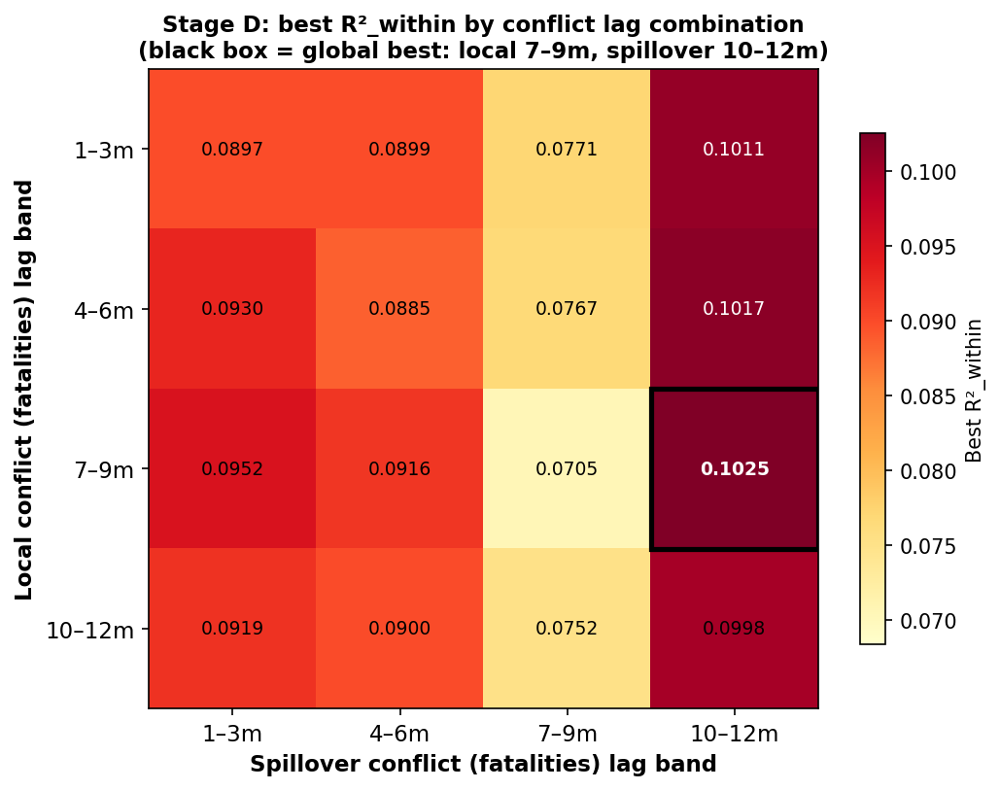
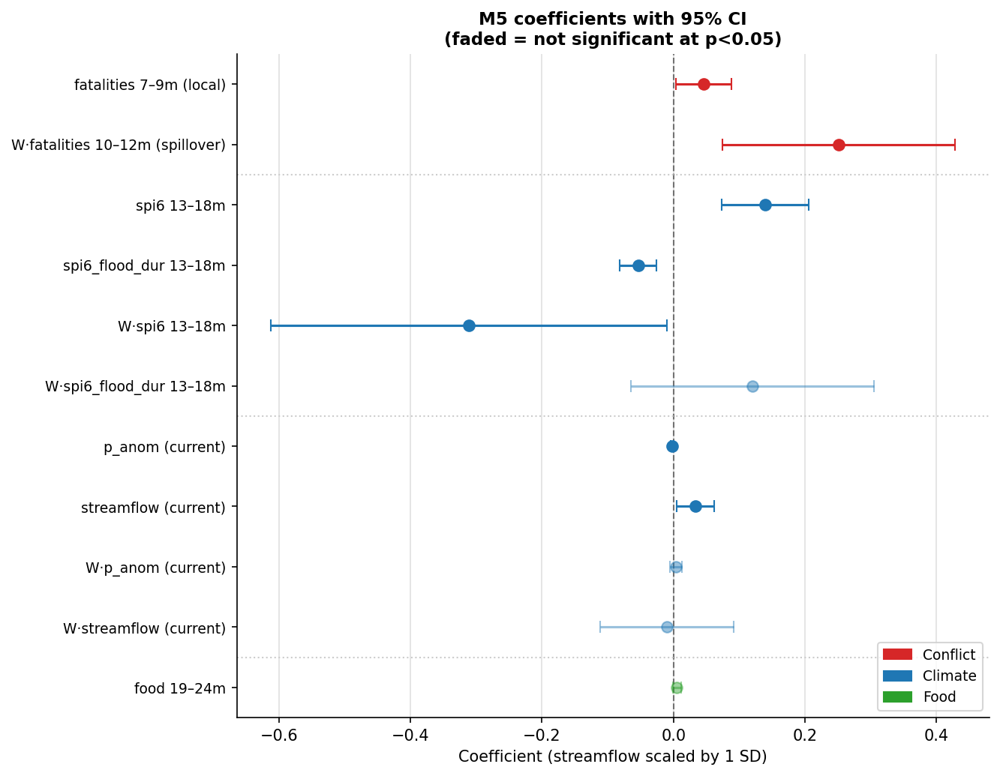
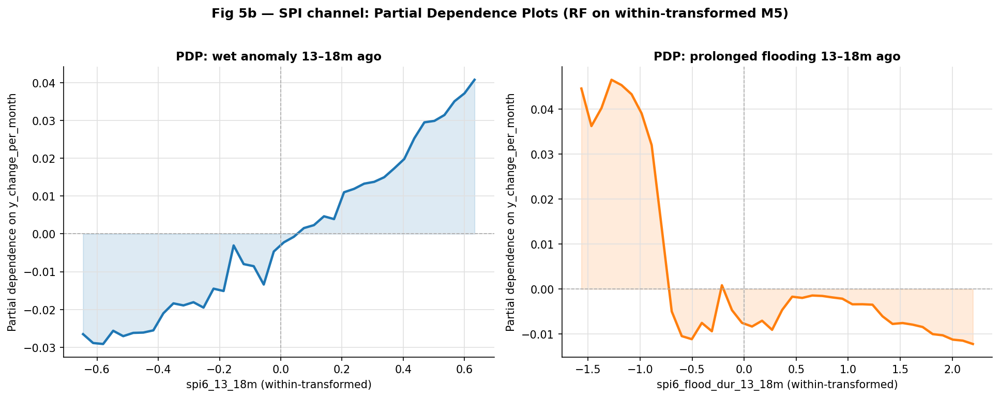
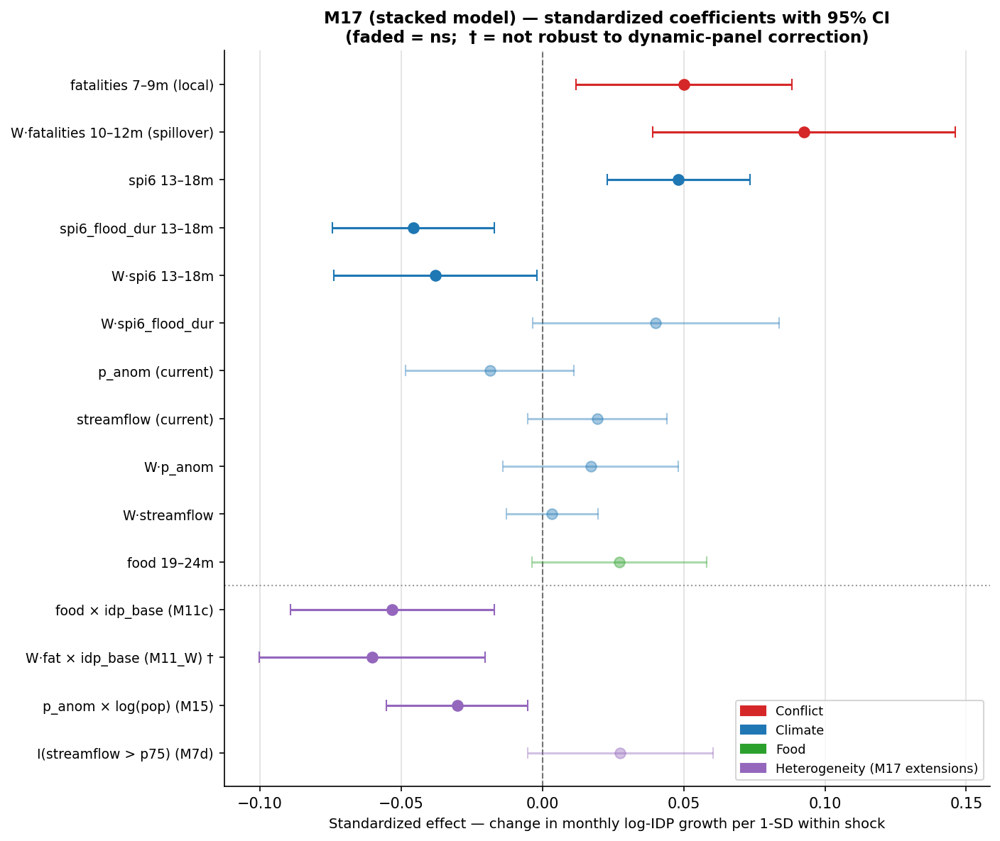

# Identifying Drivers of Internal Displacement in Mali
### A Panel Regression Analysis with Random Forest Validation

---

## Overview

We model monthly changes in log-IDP counts across Mali's 50 admin2 cercles
(2014–2024) as a function of three candidate driver families: **conflict**,
**climate**, and **food prices**. Our goal is to identify the drivers of
displacement — their **form, lag, and heterogeneity** — and to state **how
credibly each can be read as causal**, being explicit about what a panel
regression can and cannot establish.

The analysis proceeds in two parts:

1. **Model selection** (Stages A–E): a structured funnel that narrows 282
   candidate features to the 11 retained in the final model (M5), growing the
   specification from 1 feature to the final model one step at a time.
2. **Validation and extensions** (Parts II–IV): Random Forest stress-tests
   the linear model, heterogeneity tests reveal what the average effects hide,
   and the independent refugee-outflow outcome cross-validates the findings.

**Identification — what the design can claim.** We have no instrument or natural
experiment for the drivers, so these are not clean causal point estimates. But
the design supports a **graded causal reading**, strongest where it matters most:

- **Two-way fixed effects** remove every time-invariant cercle difference and
  every common time shock — the dominant confounders.
- **Drivers enter only at lags** (conflict 7–12m, climate 13–24m), with the
  contemporaneous window excluded, so reverse causality is implausible.
- **Climate** (rainfall, SPI, streamflow) is plausibly **exogenous** to local
  displacement — weather is not caused by who fled — so the climate channel
  approaches a natural experiment.
- The headline result, **conflict *spillover*** (neighbour violence), cannot be
  reverse-caused: a cercle's own displacement cannot have produced its
  neighbours' *earlier* violence.
- **Weakest:** *local* conflict (not exogenous) and *food* (a near-national
  series with little within-cercle variation) — reported with corresponding
  caution.

We therefore identify the drivers and their structure with **graded causal
confidence**, not uniform causal certainty.

**Data.** IDP source: DTM survey panel, zero-run-filtered and re-stitched<!-- (`delta_idp_zrt5.csv`). -->Sample: n = 1,417 observations, 44 cercles, after
requiring complete data for all M5 features. Conflict: ACLED strict (direct
lethal violence). Climate: ERA5 reanalysis. Food: WFP price monitoring.
Spatial weights: road-distance decay matrix<!--  (`weighting_beta1.csv`)-->.

**Survey structure — irregular rounds and zero-change intervals.** DTM runs 81
irregular survey rounds (2014–2024) with non-uniform gaps, and many cercles miss
rounds; in the raw panel **~65% of adjacent-round changes are exactly zero**
(repeated figures, not fresh surveys). We apply a **months-based zero-run
filter**: a run of consecutive zero-change rounds is kept when the non-zero
changes bracketing it are **≤5 months apart**, but a longer run is dropped and
the series re-stitched into a single survivor-to-survivor interval
(<!-- `delta_idp_zrt5.csv`; -->3,078 → 1,622 intervals, zeros 65% → 33%, gaps now
1–96 months<!-- ; reproduced by `scripts/run_zero_run_filter.py` -->). The outcome is
then expressed **per month** (÷`months_between`) so the re-stitched intervals
stay comparable, and intervals longer than 6 months are excluded — leaving
**n = 1,417** across 44 cercles.

**Notation.**

- $y_{it}$ = monthly change in log-IDP (`y_change_per_month`) for cercle $i$ at
  survey date $t$
- $C_{it}$ = controls: `log1p_idp_t1` (AR anchor), `months_between`
- $\alpha_i,\gamma_t$ = cercle and time fixed effects; SE clustered on cercle
- $f(\cdot)$ = feature transform: `log1p` for non-negative counts, identity for
  signed anomalies
- $Wx$ = spatial-spillover twin of $x$ (neighbour-weighted average at the same
  lag band)

**Three criteria for variable inclusion** (applied throughout):
1. **ΔR²_within** — does the variable add explanatory power?
2. **p-value** — is the signal distinguishable from noise?
3. **Coefficient sign** — is the direction mechanistically coherent?

No variable earns its place on one criterion alone.

---

### Feature construction

**Outcome.** The regression target is `y_change_per_month` = (log1p(IDP_t2) −
log1p(IDP_t1)) / months_between — the average monthly log-IDP growth over each
survey interval. Dividing by `months_between` makes observations comparable
regardless of survey gap length (intervals range from 1 to 6 months).

**Transforms.** The transform for each feature is chosen by value distribution:

- **Conflict** (`fatalities`, `events`): always non-negative counts → **log1p**
  transform. This compresses the heavy right tail (rare extreme events) and
  makes the relationship approximately linear on a proportional scale.
- **Climate**: all 112 climate local features use **identity (no transform)**.
  Most are signed anomalies (SPI, temperature, rainfall, streamflow, NDVI,
  soil moisture) that can be negative, so log1p is not applicable. The SPI-derived
  duration and severity variables (`spi6_flood_duration`, `spi6_drought_severity`,
  etc.) are non-negative, but are kept on identity via an explicit override —
  these are already-derived intensity measures where log1p would distort the
  natural scale and reduce |t| empirically.
- **Food**: `inflation_food_price_index` (a growth rate, signed) → identity.
  `c_food_price_index` and `c_maize` (price levels, non-negative) → **log1p**.

**Lag structure — banded windows.** Rather than point lags (the value at exactly
N months ago), we use **non-overlapping banded window averages**. A band
`[lo, hi]m` takes the mean of the monthly variable over the window from
`month_of(t1) − hi` to `month_of(t1) − lo`, strictly before the observation
start `t1`. For example:

| Band | window | interpretation |
|---|---|---|
| 1–3m | months 1, 2, 3 before t1 | short-term pre-survey |
| 7–9m | months 7, 8, 9 before t1 | medium-term |
| 10–12m | months 10, 11, 12 before t1 | ~one year lag |
| 13–18m | months 13–18 before t1 | slow-burn effects |
| 19–24m | months 19–24 before t1 | long-term |

Banded windows are **non-overlapping** — the 1–3m and 4–6m bands contain
different months, so they can be included jointly without multicollinearity from
overlap. This is why distributed-lag models (including all bands simultaneously)
remain feasible up to the point where between-band correlations become a problem.

Conflict uses bands 1–3m, 4–6m, 7–9m, 10–12m (no longer lags — conflict is not
expected to have displacement effects at 2+ year horizons). Climate and food use
the same four short bands plus 13–18m and 19–24m (slow-burn pathways exist for
climate). The **current window** (0 months lag, i.e. the observation period
`(t1, t2]` itself) is used only for climate and food — conflict in the current
window is excluded because it risks reverse causality (displacement events may
*cause* conflict rather than vice versa).

This exclusion is **by design, not by fit**. Added to M5, current-window local
conflict is in fact positive, significant, and strong (+0.078\*\*, ΔR² = +0.012 —
*larger* than the lagged 7–9m term). That is precisely the problem: a strong
*contemporaneous* conflict–displacement association within the same interval is
exactly what reverse causality would produce (displacement can trigger or
coincide with violence — retaliation, competition in receiving areas, militia
activity around camps), and within one window the two directions cannot be
separated. The lagged design (local 7–9m, spillover 10–12m) is what makes the
causal reading defensible: past violence can precede later displacement, but
later displacement cannot have caused past violence. Current conflict is excluded
not because it fails, but because it *succeeds in a way we cannot interpret.*

**Matching monthly predictors to the irregular intervals.** Conflict, climate,
and food are monthly series, while the IDP intervals are irregular and — after
re-stitching — of varying length. They are aligned by calendar month, by **anchoring
every lag to the interval start `t1`**:
- A **lagged band** `[lo, hi]m` is the mean of the monthly series over the
  calendar months `month(t1)−hi … month(t1)−lo`, strictly before `t1`. Because it
  depends on `t1` alone (not on `t2` or the gap length), *every* interval — short
  or long, re-stitched or not — receives the same well-defined pre-interval
  history. Irregular gaps therefore do not distort the lagged predictors.
- The **current window** (lag 0, climate and food only) is the mean over the
  interval itself, `(t1, t2]`, so it automatically spans the actual gap — averaging
  one month for a 1-month interval and, say, six for a re-stitched 6-month one.
  Pairing this with the per-month outcome keeps long and short intervals comparable.
- **Conflict has no current window** (excluded above), so it enters only through
  pre-`t1` bands and is wholly unaffected by interval length.

So a re-stitched long interval changes only its *own*-window average (and the
outcome, which is per-month normalised); the conflict and lagged-climate history
that does most of the explanatory work is anchored to `t1` and unchanged.

**Cumulative windows.** Cumulative features (e.g. total fatalities over the past
12 months) were considered in early exploratory work but **not used in the final
analysis**. They overlap with adjacent banded windows, creating multicollinearity,
and the banded design already captures sustained exposure via multiple
non-overlapping bands. The final feature set contains banded windows only.

**Feature count.** The full candidate set has **282 features**: 16 conflict
(2 indicators × 4 bands × local + spillover), 224 climate (16 variables × 7
lag windows × local + spillover), and 42 food (3 variables × 7 lag windows ×
local + spillover). The indicators are:

| Family | Indicators | Transform | Lag windows |
|---|---|---|---|
| **Conflict** | `fatalities`, `events` (ACLED strict) | log1p | bands 1–3, 4–6, 7–9, 10–12m |
| **Climate** | `spi6`, `spi6_flood_dur`, `spi6_flood_sev`, `spi6_drought_dur`, `spi6_drought_sev`, `p_anom_1m`, `p_anom_3m`, `t2m_anom_1m`, `t2m_max_anom_1m`, `ndvi_anom_1m`, `ndvi_annual_change`, `ndvi_calendar_month_change`, `sm1_anom_1m`, `sm3_anom_1m`, `sm4_anom_1m`, `streamflow_anom_1m` | identity (signed anomalies) | current + bands 1–3, 4–6, 7–9, 10–12, 13–18, 19–24m |
| **Food** | `c_maize`, `c_food_price_index`, `inflation_food_price_index` | identity or log1p (level vs rate) | current + bands 1–3, 4–6, 7–9, 10–12, 13–18, 19–24m |

Each local feature has a **spatial-spillover twin** `W·X` constructed as the
row-standardised, zero-diagonal product of the road-distance weight matrix and
the panel of local values, pivoted to (time × unit) and stacked back to long
form. The spillover represents the neighbour-weighted average of the same
feature at the same lag — capturing how the cercle's neighbourhood context
affects local displacement.

---

## Part I — Linear Panel Regression

### Stage A — Screen: which features have any individual signal?

We fit each of the 282 candidate features alone (with controls and FE) and
rank by |t|-statistic, applying a Benjamini-Hochberg correction at q < 0.10:

$$y_{it} = \beta\, f(x^{(k)}_{it}) + \delta' C_{it} + \alpha_i + \gamma_t + \varepsilon_{it}, \qquad k = 1,\ldots,282$$

**Result.** Four features pass — all conflict spillovers. Zero climate, zero
food pass individually:

| Rank | Feature | coef | t-stat | q(BH) |
|---|---|---|---|---|
| 1 | `W·fatalities_7_9m` | +0.362 | 3.42 | 0.082 ✅ |
| 2 | `W·events_7_9m` | +0.762 | 3.40 | 0.082 ✅ |
| 3 | `W·fatalities_10_12m` | +0.302 | 3.33 | 0.082 ✅ |
| 4 | `W·fatalities_1_3m` | +0.281 | 3.25 | 0.084 ✅ |
| 5 | `W·events_4_6m` | +0.674 | 3.11 | 0.102 ✗ |
| 6 | `sm1_anom_1m_1_3m` *(best climate)* | +6.39 | 3.00 | 0.102 ✗ |
| 7 | `spi6_19_24m` *(best SPI, tied)* | −0.088 | 3.00 | 0.102 ✗ |

The first four are all conflict **spillovers** (`W·X`) — violence in
neighbouring cercles predicts local IDP changes. Climate just misses the
correction (two features tied at q = 0.102). Food appears nowhere near the
top.

Although climate doesn't survive the individual screen, ranks 6–21 are almost
entirely SPI-6 features at 13–18m and 19–24m lags — a coherent cluster just
below the cutoff. This tells us climate has real signal that is simply weaker
than conflict individually, and that the lag windows worth testing are 13–18m
and 19–24m.

<!-- > **Why not stop here?** The screen tests features in isolation. Because conflict
> and climate are correlated, a climate feature might look significant only
> because it proxies for conflict — or fail to appear significant only because
> conflict absorbs its variance. We need a joint model. -->

---

### Stage B — Form: local or spillover?

The screen shows conflict spillovers dominate, but doesn't tell us whether
conflict and climate should enter as **local** terms ($x$, the cercle's own
value) or **spillover** terms ($Wx$, neighbours' value). We test this with
the smallest joint model — one conflict + one climate/food partner, each in
exactly one form:

$$y_{it} = \beta\, f(\text{conflict form}) + \theta\, f(\text{partner form}) + \delta' C_{it} + \alpha_i + \gamma_t + \varepsilon_{it}$$

Fitting all four local/spillover combinations across 1,064 (conflict × partner)
pairs:

| 2-term model | median R²_within | wins (of 1,064 pairs) |
|---|---|---|
| local $x$ + local $z$ | 0.0615 | 184 |
| **spillover $Wx$ + local $z$** | **0.0732** | **564** |
| local $x$ + spillover $Wz$ | 0.0589 | 68 |
| spillover $Wx$ + spillover $Wz$ | 0.0714 | 248 |

"Wins" means: for each pair, which of the four combinations has the highest
R²? `Wx + z` wins 564 of the 1,064 head-to-head contests. The two
spillover-conflict combinations together win 812 (76%).

**Conclusion from Stage B.** Conflict belongs as a **spillover** term; its
partner belongs as a **local** term. This is the one question Stage B can
answer: *in the minimal 2-term model*, which form of each driver carries the
signal. It cannot tell us whether climate spillovers matter once conflict is
fully controlled — that requires a larger joint model. We carry both local and
spillover forms forward into Stages C and D, where the full picture emerges.

---

### Stage C — Variable: which conflict anchor?

Stage B established the form. Stage C asks which conflict **variable** (which
indicator and lag band) anchors the model. We now carry both forms of both
drivers — the four-term pair — and sweep all 8 conflict × 133 climate/food
combinations (1,064 pairs):

$$y_{it} = \beta_1 f(X) + \beta_2 f(WX) + \theta_1 f(Z) + \theta_2 f(WZ) + \delta' C_{it} + \alpha_i + \gamma_t + \varepsilon_{it}$$

Ranking by full-model R², the top five pairs are:

| Rank | Conflict (X) | Partner (Z) | R²_full | local coef (p) | W·X coef (p) |
|---|---|---|---|---|---|
| 1 | `fatalities_10_12m` | `ndvi_anom_19_24m` | 0.098 | +0.035 (0.074) | +0.292 (0.002) |
| 2 | `fatalities_10_12m` | `ndvi_annual_change_19_24m` | 0.095 | +0.036 (0.066) | +0.296 (0.001) |
| 3 | `fatalities_10_12m` | `spi6_13_18m` | 0.095 | +0.036 (0.072) | +0.304 (0.001) |
| 4 | `fatalities_10_12m` | `t2m_anom_7_9m` | 0.094 | +0.037 (0.064) | +0.309 (0.001) |
| 5 | `fatalities_10_12m` | `sm1_anom_4_6m` | 0.094 | +0.036 (0.069) | +0.304 (0.001) |
| **550** | `events_7_9m` *(best events pair)* | `ndvi_anom_19_24m` | 0.069 | +0.103 (0.016) | +0.727 (0.001) |

Three things are immediately clear from the table. First, **`fatalities_10_12m`
appears in every top pair** — whatever climate partner it is matched with, the
conflict anchor is always the same variable (19 of 20 top pairs). Second, the
**W·X spillover coefficient is the stable, dominant signal** (+0.29–0.31*** across
all top pairs), consistent with Stage B's finding that conflict acts through
neighbours. Third, local conflict is also significant (p ≈ 0.06–0.07) but
smaller — both forms are real.

The last row illustrates why W·X coefficient alone is not a sufficient criterion:
`events_7_9m` has a much larger spillover coefficient (+0.727***) than
`fatalities_10_12m` (+0.29–0.31***), yet its R²_full is only 0.069 vs 0.094–0.098.
This is a **measurement-scale artefact** — one event is a smaller shock than one
log-fatality, so the coefficient must be larger to produce the same displacement
effect. R²_within is scale-invariant and correctly identifies `fatalities_10_12m`
as the better anchor.

**No food partner rivals conflict.** Best food-partner R²_full = 0.089 vs
climate-partner best = 0.098; only 7% of food partners are significant in the
full spec.

---

### Stage D — Exhaustive search: lock the backbone, optimal lags, and find M1

Stages B–C suggested `fatalities` as the conflict variable and indicated food
adds nothing. To avoid hand-picking, we confirm this **exhaustively**. We also
remove an unjustified assumption from the simpler pairwise searches: there is
no reason the local and spillover conflict terms must use the same lag band.
Local conflict captures violence in the focal cercle itself — people flee and
register quickly (~7–9m). Spillover conflict captures arrivals from neighbouring
cercles — a slower pipeline through DTM registration (~10–12m). We search over
**independent** local lag $\ell$ and spillover lag $s$:

$$y_{it} = \underbrace{\beta_1 f(\text{conf}_{\ell}) + \beta_2 f(W\!\cdot\!\text{conf}_{s})}_{\text{conflict}} + \underbrace{\theta_1 f(z_1) + \theta_2 f(Wz_1) + \theta_3 f(z_2) + \theta_4 f(Wz_2)}_{\text{two climate variables}} + \underbrace{\phi_1 f(\text{food}) + \phi_2 f(W\!\cdot\!\text{food})}_{\text{food}} + \delta' C_{it} + \alpha_i + \gamma_t + \varepsilon_{it}$$

**Why two climate variables?** One slot forces a single pathway. Climate may
act through distinct mechanisms at different lags (e.g. wet anomaly at 13–18m
vs dry anomaly at 19–24m). Two slots from different physical source series let
the search find the best-fitting independent pair.

**3,951,360 models** (2 conflict types × 4 local lags × 4 spillover lags ×
21 food × 5,880 climate pairs), run on a compute cluster (~10h on 16 cores).
The top models by R²_within:

| Rank | Type | local lag | spill lag | Food | z1 | z2 | R²_within | n_sig |
|---|---|---|---|---|---|---|---|---|
| 1 | fatalities | **7–9m** | **10–12m** | infl_food_1_3m | spi6_13_18m | spi6_19_24m | **0.1025** | 3 |
| 2 | fatalities | 7–9m | 10–12m | infl_food_1_3m | t2m_7_9m | spi6_19_24m | 0.1023 | 3 |
| 3 | fatalities | 7–9m | 10–12m | infl_food_1_3m | spi6_13_18m | spi6_19_24m | 0.1022 | 3 |
| 4 | fatalities | 7–9m | 10–12m | infl_food_4_6m | spi6_13_18m | spi6_19_24m | 0.1020 | 3 |
| 8 | fatalities | 4–6m | 10–12m | infl_food_1_3m | spi6_13_18m | spi6_19_24m | 0.1017 | 2 |

n_sig = regressors significant at p<0.10 (out of 8).

**Three outcomes read from the table:**

**Outcome 1 — Conflict anchor and lags confirmed.** `fatalities` is in every
top model. The spillover lag is **10–12m in 100% of the top 100 models**
regardless of local-lag choice — the DTM registration delay for arrivals is
consistently ~10–12m. The local optimal lag is **7–9m** — people fleeing their
own cercle register 2–3 months faster. The mixed-lag spec (local 7–9m,
spillover 10–12m) beats the same-lag (10–12m/10–12m) by +0.0027 R².

**Why not a short 1–3m conflict lag?** A natural intuition is that conflict
should drive displacement *fast* — people flee within weeks of violence, so the
strongest signal should sit at 1–3m. We tested this directly, ranking every
local lag band:

| Local conflict lag | ΔR²_within (fatalities) | coef |
|---|---|---|
| 1–3m | +0.0075 | +0.038 * |
| 4–6m | +0.0074 | +0.034 |
| **7–9m** | **+0.0112** | **+0.049 \*\*** |
| 10–12m | +0.0078 | +0.035 * |

The 1–3m lag **is significant** — conflict does have a fast component, and the
intuition is not wrong. But the signal *strengthens* from 1–3m to a peak at
7–9m, then fades; 1–3m ranks third. The same holds for event counts (1–3m
+0.014, peak 7–9m +0.017). The reconciliation is a **measurement lag, not a
behavioural one**: our outcome is the change in the *registered* IDP stock, and
DTM enumerates displaced people months after they actually move. So even local
flight surfaces in the data at ~7–9m, not 1–3m — the lag reflects *when people
are counted*, not *when they flee*. The point is decisive for the slow spillover
channel: forcing all conflict terms to the short lag (local **and** spillover at
1–3m) collapses the model to R²_within = 0.081, versus 0.099 for the
registration-aligned mixed-lag spec — a −0.018 loss. The displacement-relevant
conflict signal is genuinely lagged.

The **spillover term** tells the same story with a twist. Sweeping its lag (local
held at 7–9m):

| Spillover (W·fatalities) lag | ΔR²_within | M5-backbone R² |
|---|---|---|
| 1–3m | +0.0290 \*\*\* | 0.0886 |
| 4–6m | +0.0271 \*\*\* | 0.0854 |
| 7–9m | +0.0121 \*\*\* | 0.0574 |
| **10–12m** | **+0.0398 \*\*\*** | **0.0992** |

Unlike the local term — which rose to a single 7–9m peak and was only marginal at
1–3m — the spillover is **significant at every lag**, with 1–3m strongly so
(+0.269 \*\*\*). This is because **conflict is highly autocorrelated**: a cercle
violent 10–12m ago was usually also violent 1–3m ago, so any window proxies the
same underlying neighbour-violence signal, and no lag is ever truly "off." The
1–3m significance is therefore not evidence of a fast spillover channel — it is
the autocorrelation showing through. The lag that **maximises fit** is still
10–12m, in both univariate ΔR² (+0.040 vs +0.029 at 1–3m) and the full model
(0.099 vs 0.089), matching the arrival pipeline: people fleeing a neighbouring
cercle must travel, then be registered, a slower process than local flight. (The
7–9m row collapses to 0.057 only because spillover at 7–9m collides with the
local 7–9m term — a collinearity artifact, not a genuine dip.)



**Figure 4.** Best R²_within for every combination of local and spillover
conflict lag (3.9M-model search). The global optimum is local 7–9m × spillover
10–12m (black box) — local conflict registers faster than neighbour spillover,
so the two channels carry different optimal lags.

We also check whether **climate spillovers** benefit from different lags
between local and spillover terms. The answer is no — for all three climate
variables the same-band spillover is already optimal or any alternative
produces marginal / mechanistically unclear gains:

| Climate variable | local band | best spillover band | ΔR² vs same-band |
|---|---|---|---|
| `spi6` | 13–18m | **13–18m (same)** | 0.000 — same band is clearly best |
| `p_anom` | current | 13–18m ** | +0.001 — too small to justify a change |
| `streamflow` | current | current (same) | all ns — no clear winner |

The mixed-lag finding is therefore **specific to conflict**: the physical travel
and registration delay for arrivals from neighbours creates a measurable lag
difference. Climate variables affect livelihoods within the focal cercle
directly; their spillover terms reflect neighbours' climate, which acts on the
same timescale as the local term.

**Outcome 2 — Food local is null; W·food is also dropped.** The local food
term is 0% significant across all top 100 models regardless of which food
variable or lag is used — food contributes nothing as an independent driver.
`inflation_food_19_24m` is retained as a null completeness placeholder (most
spatial variation among food variables, giving positive within-R²).

The food **spillover** term (W·food) is also excluded. `inflation_food_price_index`
is a near-national time series — **90% of its variance is between-time** (common
price shocks absorbed by time FE), leaving little spatial variation for a
spillover to capture. Empirically, `W·inflation_food_19_24m` has p=0.729 and
corr(food, W·food) = +0.83 in the raw data. We checked all 21 food variables:
`c_food_price_index` is the exception where W·food is significant (p≈0.035)
because its negative local–spillover correlation captures food price
*differentials* between cercles — but even with that variable the best R²_full
is only 0.063, far below the inflation-food variants (~0.10). The W·food term
is therefore dropped entirely.

The backbone is now fully locked: **`fatalities_7_9m` (local) +
`W·fatalities_10_12m` (spillover) + `inflation_food_19_24m` (no W·food)**.

**Outcome 3 — M1 and candidate second channels identified.** The top models
by raw R² all have n_sig = 3 — one climate variable typically insignificant
(NDVI noise inflation). Applying the both-significant criterion across the
5,880 backbone rows, sorted by R²_within:

| z1 | z2 | R²_within | z1 coef (p) | z2 coef (p) | within-corr | note |
|---|---|---|---|---|---|---|
| `sm3_7_9m` | `t2m_max_13_18m` | 0.0968 | +2.07 (0.21) | −0.04 (0.49) | — | ✗ raw max — both ns (noise) |
| **`spi6_13_18m`** | **`spi6_flood_dur_13_18m`** | **0.0967** | **+0.134 (0.000)** | **−0.056 (0.001)** | **+0.46** | **→ M1** |
| `spi6_13_18m` | `spi6_flood_severity_13_18m` | 0.0960 | +0.131 (0.000) | −0.030 (0.001) | +0.53 | SPI facet pair |
| `t2m_1_3m` | `sm1_7_9m` | 0.0933 | −0.076 (0.048) | +4.407 (0.039) | +0.086 | → M2 candidate |
| `p_anom_cur` | `streamflow_cur` | 0.0914 | −0.002 (0.024) | +0.000 (0.016) | +0.042 | → M3 candidate |

**M1** is the top both-significant pair: `spi6_13_18m` (wet anomaly 13–18m ago
→ displacement, +0.134***) and `spi6_flood_dur_13_18m` (prolonged prior
flooding → wave absorbed, −0.056***). Both coefficients are *** and the
mechanistic story is coherent.

The within-corr of +0.46 between the two SPI terms is a warning sign by the
two-step rule, but both variables survive jointly at p<0.001, and dropping
either collapses the other's coefficient by 60% — confirming they jointly
identify two distinct facets of the same flood signal: a level effect and a
wave-absorption effect. High correlation between flood level and duration is
physically expected (larger floods last longer) and does not invalidate joint
use when both are clearly identified.

**M2 and M3 candidates** are identified from the same table — the best
both-significant pairs that contain no SPI variables (since SPI is already M1)
and have low within-correlation between their two variables:
- **M2** = `t2m_1_3m` + `sm1_7_9m` (R²=0.0933, within-corr=+0.086) — temperature at 1–3m and soil moisture at 7–9m, different lags so near-orthogonal
- **M3** = `p_anom_cur` + `streamflow_cur` (R²=0.0914, within-corr=+0.042) — contemporaneous rainfall and river flow, near-orthogonal

These will be tested as standalone second channels in Stage E, then combined
with M1 to form M4 and M5. **M0** (backbone only) and **M1** (backbone + SPI)
are the two reference models carried into Stage E. (R² values are reported in
the Stage E table below, fit on the locked common sample.) Stage E asks whether
a second climate channel adds independent signal beyond M1.

---

### Stage E — Final model: does a second climate channel help?

The Stage D formula has exactly two climate slots ($z_1, z_2$). Stage E asks
whether a **second independent climate channel** adds signal beyond M1. This
requires a new, larger formula that allows two climate families — each with
local and spillover terms:

$$y_{it} = \underbrace{\beta_1 f(\text{conf}) + \beta_2 f(W\!\cdot\!\text{conf})}_{\text{conflict}} + \underbrace{\theta_1 f(c_1) + \theta_2 f(Wc_1) + \theta_3 f(c_2) + \theta_4 f(Wc_2)}_{\text{channel 1}} + \underbrace{\theta_5 f(c_3) + \theta_6 f(Wc_3) + \theta_7 f(c_4) + \theta_8 f(Wc_4)}_{\text{channel 2 (new)}} + \phi\, f(\text{food}) + \delta' C_{it} + \alpha_i + \gamma_t + \varepsilon_{it}$$

where channel 1 is fixed to the Stage D winner (SPI: $c_1$=`spi6_13_18m`,
$c_2$=`spi6_flood_dur`) and channel 2 is the candidate second channel. We
also test standalone alternatives (M2, M3) and combinations (M4, M5). All
models share the locked backbone; M0 and M1 use the Stage D formula (8 terms),
M2–M5 use this extended formula (12 terms):

| Label | composition | climate block | # terms | R²_within | ΔR² vs M1 |
|---|---|---|---|---|---|
| **M0** | backbone only | none | 0 | 0.091 | — |
| **M1** | backbone + Ch1 | SPI {`spi6_13_18m`, `spi6_flood_dur`} | 4 | 0.095 | (base) |
| **M2** | backbone + Ch2a | `t2m_1_3m` + `sm1_7_9m` | 4 | 0.099 | +0.004 |
| **M3** | backbone + Ch2b | water shock {`p_anom_cur`, `streamflow_cur`} | 4 | 0.094 | −0.001 |
| **M4** | M1 + M2 (Ch1 + Ch2a) | SPI + temperature/soil | 8 | 0.102 | +0.007 |
| **M5** | **M1 + M3 (Ch1 + Ch2b)** | **SPI + water shock** | 8 | **0.099** | **+0.004** |

M2 (temperature + soil moisture) and M3 (water shock) are each tested as
standalone second channels alongside M1. M2 alone (R²=0.099, ΔR²=+0.004)
actually fits better than M3 alone (R²=0.094, ΔR²=−0.001). But the two-channel
combinations tell a different story: in **M4** (SPI + M2), `t2m_1_3m` drops to
**ns (p=0.127)** in the joint model — the temperature signal is partly absorbed
by the SPI channel when both are present, and only the soil moisture component
survives. In **M5** (SPI + M3), all four climate variables remain significant in
the joint model (p_anom p=0.023**, streamflow p=0.020**). M5 therefore provides
a cleaner two-channel decomposition: one slow SPI channel and one contemporaneous
water-shock channel, both independently identified. **M5 is the recommended
specification.**

**How stable is this choice?** A cercle cluster-bootstrap (200 resamples)
confirms the *backbone* is robust — conflict spillover and the SPI flood term are
positive in **100%** of resamples (95% CIs [+0.09, +0.48] and [+0.09, +0.21]) —
but the *second climate channel* is genuinely close: M4 and M5 are a coin-flip on
R²_within (M4 > M5 in 52% of resamples). M5 is preferred because M4's temperature
term is significant in only **23%** of resamples, versus 52–65% for M5's
acute-water terms. The backbone is therefore solid; the *exact identity* of the
second climate channel sits at the edge of the data and should be read as such.


### The final model: M5
```math
y_{it} = \underbrace{\beta_1 f(\text{fat}_{7\text{-}9}) + \beta_2 f(W\!\cdot\!\text{fat}_{10\text{-}12})}_{\text{conflict (mixed lag)}} + \underbrace{\theta_1 f(\text{spi6}_{13\text{-}18}) + \theta_2 f(\text{flood\_dur}_{13\text{-}18}) + \theta_3 f(W\!\cdot\!\text{spi6}) + \theta_4 f(W\!\cdot\!\text{flood\_dur})}_{\text{SPI flood channel}} + \\ \underbrace{\theta_5 f(\text{p\_anom}) + \theta_6 f(\text{stream}) + \theta_7 f(W\!\cdot\!\text{p\_anom}) + \theta_8 f(W\!\cdot\!\text{stream})}_{\text{acute water channel}} + \phi\, f(\text{food}_{19\text{-}24}) + \delta' C_{it} + \alpha_i + \gamma_t + \varepsilon_{it}
```
**R²_within = 0.0992**, n = 1,417, 44 cercles, SE clustered on entity:

| Driver | Coef | SE | p | |
|---|---|---|---|---|
| log1p_idp_t1 (AR control) | −0.179 | 0.045 | 0.000 | *** |
| fatalities_7_9m (local) | +0.046 | 0.022 | 0.032 | ** |
| **W·fatalities_10_12m (spillover)** | **+0.252** | **0.090** | **0.005** | *** |
| spi6_13_18m | +0.139 | 0.034 | 0.000 | *** |
| spi6_flood_dur_13_18m | −0.054 | 0.014 | 0.000 | *** |
| W·spi6_13_18m | −0.311 | 0.154 | 0.043 | ** |
| W·spi6_flood_dur_13_18m | +0.120 | 0.094 | 0.202 | ns |
| p_anom_1m (current) | −0.002 | 0.001 | 0.023 | ** |
| streamflow_1m (current) | +0.0001 | 0.00003 | 0.020 | ** |
| W·p_anom_1m | +0.004 | 0.005 | 0.417 | ns |
| W·streamflow_1m | −0.000 | 0.000 | 0.839 | ns |
| inflation_food_19_24m | +0.005 | 0.003 | 0.122 | ns |



**Figure 3.** M5 coefficients with 95% CI. Faded markers are not significant at
p<0.05; streamflow is scaled by 1 SD for display. Conflict spillover is the
largest effect; the SPI level term and its negative spillover are significant;
the acute water terms are small; food is null.

**Interpreting M5.** The AR control `log1p_idp_t1` (−0.179***) is the dominant
single term — cercles with high IDP stock grow more slowly (mean reversion). It
is not an incidental nuisance but a structural feature of the data: IDP counts
are highly persistent, so last period's stock strongly predicts this period's
change direction. Without this control, fitting conflict + climate + food alone
gives R²_within < 0 — the model predicts *worse* than the fixed-effects baseline
alone, because the uncontrolled mean-reversion structure overwhelms the driver
signals. Including `log1p_idp_t1` corrects for this and gives all drivers a fair
chance to explain the residual variation.

The cleanest way to see what the drivers contribute is to split the model in
two steps. **Step 1:** fit only the controls (AR + `months_between`) — this
gives R²_within = 0.048, capturing the mean-reversion structure alone.
**Step 2:** add the three driver families on top — this adds +0.051, bringing
the total to R²=0.099. That +0.051 is what conflict, climate, and food
collectively explain *beyond* the auto-correlation structure.

Within that +0.051, a **LOO (Leave-One-Out) decomposition** — refit with each
driver block removed, measure the R² drop — shows the relative importance:

| Driver block | ΔR² when removed | share of driver contribution |
|---|---|---|
| **Conflict** (local + spillover) | −0.037 | **72%** |
| **Climate** (all 8 terms) | −0.008 | **16%** |
| Food | +0.000 | — (null) |

Conflict accounts for roughly three-quarters of the driver-explained variance;
climate adds a further 16%. Food is null — its coefficient is near zero and
removing it leaves the fit essentially unchanged, which is why it is kept only as
an explicit null finding rather than a genuine contributor.

Conflict drives displacement through **neighbours** more than through the focal
cercle (spillover +0.252*** vs local +0.046**). The 5× ratio is consistent with
people fleeing *toward* safer cercles — registering as IDP arrivals there rather
than as departures from the conflict cercle.

**SPI flood channel** — this channel operates with a 13–18 month lag and
captures two distinct effects of past rainfall on the same variable:

- `spi6_13_18m` (+0.139***): a **wet anomaly** 13–18 months ago increases
  current displacement. The mechanism is flooding — above-normal rainfall
  causes crop damage, home destruction, and health risks that push people out
  over the following months.
- `spi6_flood_dur_13_18m` (−0.054***): a **longer flood duration** at the same
  lag *reduces* current displacement. This is the wave-absorption effect — if
  the flooding was prolonged, the vulnerable population has already fled in
  earlier periods, leaving fewer people to displace now.

Together the two terms say: a sudden, short-lived wet shock drives a large
displacement wave; a prolonged flood gradually drains the catchment population
so that later displacement is smaller. The net effect on any given observation
depends on both the level and duration of the past wet anomaly.

**The flood channel is about sharpness, not size.** `spi6` and `flood_dur` are
positively correlated (within-corr +0.46), so their individual coefficients are
entangled partial effects. Rotating the pair into orthogonal axes (PCA; the fit
is identical and every other coefficient is unchanged) makes the mechanism
unambiguous: a **flood-magnitude** axis — intensity and duration rising together
— is *non-significant* (+0.008), while a **flood-sharpness** axis — intensity net
of duration — carries the entire effect (+0.111\*\*\*). It is not how large a
flood is, but how *acute* it is: a short, intense flood displaces; a prolonged
one of the same size does not. This is the wave-absorption mechanism expressed in
a single, collinearity-free coefficient (VIF 1.2–1.3, vs 1.5–1.7 for the
entangled pair).

The **spillover `W·spi6_13_18m`** (−0.311**) is negative and larger in
absolute magnitude than the local term. This means a flood anomaly in
*neighbouring* cercles *reduces* local IDP counts. The mechanism is spatial
absorption: when neighbours flood, their displaced population flows *out* toward
less-affected cercles (including the focal cercle). The focal cercle receives
arrivals, but these arrivals are already counted in its IDP stock through the
IDP-receipt pipeline. The negative spillover captures a different dynamic —
when neighbours have high SPI, there is less net *outward* pressure from the
focal cercle itself because neighbours' floods are directing people away, not
toward conflict zones. Both signs are empirically robust and mechanistically
coherent.

**Reading the SPI flood block: three facets, one channel.** M5 carries three
SPI terms — `spi6` (+0.139), `spi6_flood_dur` (−0.054), and `W·spi6` (−0.311) —
with mixed signs that can look contradictory in isolation. Three points make the
block readable as a single flood channel rather than three competing numbers.

*They are not redundant.* The three correlate in a **star** pattern: `spi6` is
the hub (within-corr +0.46 with duration, +0.42 with the spillover), but duration
and the spillover are essentially independent of each other (+0.09). All three
VIFs are low (1.2–1.55), so each is **separately identified** — this is an
interpretation question, not a collinearity problem, and (as the robustness
section shows) dropping the spillover would artificially shrink the local term.

*On a common scale they matter comparably — and the big coefficient is the
smallest effect.* `W·spi6`'s −0.311 looks dominant, but it sits on a variable
that barely varies within a cercle (within-SD 0.12). Per 1-SD within shock the
three standardized effects are +0.055 (`spi6`), −0.059 (duration), and −0.037
(`W·spi6`) — comparable in size, with the headline-grabbing spillover actually
the *weakest* in practice.

*What a reader should take away.* Because a real flood moves these together, the
net effect depends on the *type* of flood:

| Flood scenario | net standardized effect |
|---|---|
| **Sharp local flood** (intense, short, neighbours dry) | **+0.055** — displaces |
| Prolonged local flood (intense **and** long) | −0.004 — ≈ cancels (duration absorbs) |
| Regional flood (local **and** neighbours wet) | +0.018 — neighbour absorption offsets ~⅔ |
| Widespread prolonged flood (all three) | −0.041 — net dampening |

The bottom line is simple: **a sharp, localised flood drives displacement; a
prolonged or widespread one does not** — because duration drains the vulnerable
population in advance and neighbouring floods redistribute people across cercles.
The three coefficients are the machinery; this table is the message.

**Acute water channel** — unlike SPI which captures rainfall accumulated over
months, this channel operates in the **current observation window**:

- `p_anom_1m` (−0.002**): current **rainfall is protective**. Higher rainfall
  during the observation period reduces displacement — rainfall supports
  agricultural livelihoods, reducing food stress and the need to migrate. The
  negative sign reflects a contemporaneous stabilising effect.
- `streamflow_anom_1m` (+0.0001**): current **river flow is displacing**. Higher
  streamflow means active flooding of riverbanks and floodplains, directly
  forcing displacement. The coefficient is tiny in absolute terms but the
  variable has a wide range — a one-standard-deviation increase in streamflow
  (≈ +85 m³/s above normal) corresponds to roughly +0.03 additional monthly
  log-IDP growth, comparable to one-tenth of the conflict spillover effect.

The opposite signs of rainfall (protective) and streamflow (displacing) in the
same current window are not contradictory — they capture two different aspects
of water: rainfall on land supports crops, while river flooding destroys
them. Both are robustly significant across specifications and lag choices.

Food (inflation_food_19_24m) is null (p=0.122). This is not a modelling failure
— it is a finding. All 21 food variables, at all lag bands, are null in the
multivariate setting. Food's apparent signal in raw correlations is a
cross-sectional baseline artefact absorbed by entity FE.

---

## Part II - Random Forest
### Is M5 misspecified? Random Forest validation and functional-form tests

### How we use Random Forest

Panel regression with two-way fixed effects (**TWFE**) and Random Forest (**RF**) are fundamentally different models, and that
difference is precisely what makes RF useful as a complement.

**TWFE** imposes strong structure: linearity, additivity, and — crucially —
**fixed effects** that absorb all time-invariant differences between cercles and
all common time shocks. The coefficients estimate within-cercle, within-time
associations. The price of this identification structure is that it can only
fit linear, additive relationships, and it discards the cross-sectional
baseline information that entity FE removes.

**Random Forest** imposes none of these constraints. It fits splits and branches
that can capture thresholds (a variable only matters above a certain level),
interactions (the effect of conflict depends on drought severity), and non-linear
curves — all without assuming linearity or additivity. Crucially, it does **not**
assume fixed effects: when run on the raw (un-demeaned) data it retains the
cross-sectional baseline differences between cercles that TWFE discards. This
gives RF access to more structure, but at the cost of causal identification —
RF has no standard errors, no FE, and no way to separate genuine causal signals
from confounding by stable cercle characteristics.

We exploit this difference in two ways:

1. **Misspecification diagnostic.** We fit RF on the *within-transformed* M5
   features (entity + time demeaned — the same variation that TWFE uses) and
   compute non-linearity scores and Friedman H-statistics for interactions.
   If RF finds that a feature's contribution is highly non-linear, it is
   suggesting that TWFE's linear coefficient may be missing real structure.
   Every such signal is then **tested formally in TWFE** — the only framework
   that provides credible inference.

2. **Predictive validation.** We evaluate RF out-of-sample using **entity-blocked
   5-fold cross-validation (OOS R²)** — "OOS" means *out-of-sample*, i.e. the
   model is fit on some cercles and evaluated on held-out cercles it has never
   seen. This prevents overfitting and gives an honest estimate of how well the
   model generalises. The M5-restricted RF (13 features) achieves OOS R² = 0.085
   — *better* than the full 282-feature RF (0.075). Adding 269 more features
   hurts generalisation, confirming that M5's variable selection is not just
   good for in-sample fit but also predictively sound.

The raw (un-demeaned) RF ceiling is OOS R² = 0.144. The gap between 0.144 and
TWFE's 0.099 reflects the cross-sectional baseline structure (stable cercle
differences) that entity FE removes by design — not a specification failure on
TWFE's part. The two methods are answering different questions: TWFE asks *what
drives within-cercle change*; raw RF asks *what predicts displacement levels
overall*.

Even at its best (OOS R² = 0.144), RF is **not good enough to build a
reliable operational forecast** — 86% of the variance in displacement remains
unexplained. Displacement is driven by many factors beyond the three driver
families we measure (local governance, inter-community relations, individual
household decisions) and the data we have cannot capture them. This means RF's
role here is not to provide predictions, but to serve two narrower purposes:
**cross-checking** that M5's variable selection is sound (the M5-restricted RF
generalises better than the full-feature RF, confirming the TWFE funnel
selected the right variables), and **functional-form testing** (flagging
non-linearities and interactions for TWFE to verify). Both uses are valuable
precisely because they do not require RF to be a good predictor overall.

### RF configuration and results

**What we feed into RF.** We fit RF on the **within-transformed** M5 features —
the same entity + time demeaned variation that TWFE uses (subtract the
cercle mean, the time mean, and add back the grand mean for each variable).
This keeps RF in the same identification space as TWFE, so that any pattern RF
finds is a pattern in the within-cercle variation, not in stable baseline
differences between cercles. The RF uses 500 trees, `max_features=0.2`,
entity-blocked 5-fold cross-validation (folds defined by cercle, so each
held-out fold is an unseen set of cercles). Permutation importance is computed
on the held-out test fold of each CV split — not on the training data — which
prevents inflated importance scores.

**OOS R² results:**

| RF variant | features | OOS R² |
|---|---|---|
| Full demeaned (282 features) | all candidate features, within-transformed | 0.075 ± 0.066 |
| **M5-restricted demeaned** | 13 M5 features, within-transformed | **0.085 ± 0.041** |
| Full raw (282 features) | raw features + entity OHE + month index | 0.144 ± 0.061 |
| M5 raw | 13 M5 features, raw | 0.123 ± 0.046 |

M5-restricted RF achieves better OOS R² than the full 282-feature RF (0.085 vs
0.075) — adding 269 more features actively hurts generalisation, confirming
that TWFE's variable selection is predictively sound.

**Why not the raw variants, despite their higher OOS R²?** Their extra accuracy
is not driver signal. The raw models include entity one-hot encodings and a
month index — and the raw feature *levels* themselves leak cercle identity (a
persistently floody cercle has persistently high streamflow) — so the forest
scores well by learning *which cercle and which month* it is looking at: stable
baselines and the overall time trend. That is precisely the confounded
cross-sectional variation that fixed effects remove for identification. Knowing
a cercle's baseline predicts its displacement level but says nothing about what
*causes* within-cercle change. The demeaned variants are therefore the
benchmark that matches TWFE's causal question; the raw R² = 0.144 is reported
only as the prediction ceiling, not as a candidate model.

**Permutation importance — which features carry the prediction?** Before asking
*how* features act (non-linearity, below), we ask *which* ones the best variant —
the M5-restricted demeaned RF — actually leans on out-of-sample:

| Feature | perm. importance (held-out) |
|---|---|
| **log1p_idp_t1 (AR control)** | **+0.115** |
| W·spi6_flood_dur | +0.019 (noisy, ±0.013) |
| spi6_13_18m | +0.008 |
| W·fatalities | +0.007 |
| streamflow_cur | +0.005 |
| fatalities_7_9m (local) | +0.005 |
| food, p_anom, remaining terms | ≈ 0 |

Three observations. First, **the AR control dominates prediction** — an order of
magnitude above any driver. Mean reversion is most of the *predictable* signal,
matching Part I's decomposition (controls alone explain 0.048 of M5's 0.099).
Second, among the drivers, **the SPI-flood and conflict terms top the list and
food is ≈ zero** — consistent with the TWFE family ranking (conflict and climate
real, food null), though not a clean conflict > climate ordering: permutation
importance is an out-of-sample *predictive* metric under entity-blocked CV,
which penalises sparse, spiky conflict shocks and splits credit between
correlated local/spillover twins. Third, on the **full 282-feature RF** the
conflict group's summed importance is ≈ 0 while climate's is positive — an
artifact of unequal group sizes (224 climate features vs 16 conflict) and
importance-sharing among correlated lags. These distortions are exactly why the
driver ranking in this report rests on the TWFE LOO decomposition, not on RF
importance: the RF importances are used only as a coarse cross-check (food null
confirmed; AR dominance confirmed), not as a causal ordering.

The AR control's dominance reflects the **persistence of displacement stocks**,
not the unimportance of the drivers: prediction rewards persistence (knowing
where the stock is today is the best guide to where it will be next), while the
drivers' role — modest in predictive terms — is the causally interpretable
signal the rest of the report quantifies.

Importance tells us *where* the predictive signal lives; it says nothing about
*what shape* it takes. The next step — the section's misspecification-diagnostic
purpose — asks whether the RF uses each feature **linearly** (in which case
TWFE's linear coefficient already captures it) or **non-linearly** (structure
the linear model might miss). With only eleven M5 driver features this scan is
cheap, so non-linearity scores are computed for **all** of them, not only the
important ones. Importance is therefore not a gate but the **interpretive key**: the
non-linearity score is normalised to each feature's *own* contribution, so a
high score on a near-zero-importance feature means the forest is sharply bending
a feature it barely uses — likely noise — while non-linearity on a feature with
genuine importance deserves a formal test. (The same scan, extended to all 282
candidate features, is reported below — it surfaces no new driver.)

### How we detect non-linear terms and classify their form

The RF gives us three complementary diagnostics, all built from the
**partial-dependence plot (PDP)** — the RF's estimated average response of the
outcome to a feature (or pair), holding the others fixed. Each answers a
different question:

| Diagnostic | Built from | Answers |
|---|---|---|
| **Non-linearity score** = 1 − R²(linear fit of the PDP) | 1D PDP of one feature | *Is* the effect non-linear? (0 = straight line, 1 = fully non-linear) |
| **PDP shape** | the same 1D PDP, read visually | *Which* form — a step or a smooth bend? |
| **Friedman H-statistic** | 2D PDP of a feature pair | Do two features *interact* (joint effect ≠ sum of separate effects)? |

The procedure has two stages:

**Stage 1 — detect.** The non-linearity score scans every M5 feature and flags
those whose response departs from a straight line; the H-statistic scans every
pair and flags those that move together. This is purely a *nomination* step — it
says *that* something non-linear is present, not what it is.

**Stage 2 — classify the form.** For each flagged feature we read the PDP shape
to decide which single functional form to test:

- **flat, then a jump (step)** → a **threshold**: test a dummy `I(x > pN)`
- **smooth monotone bend** → a **curve**: test a **quadratic** `x²`
- a curve that only bends when a *second* feature is high (flagged by the
  H-statistic) → an **interaction**: test the product `x × z`

So the three candidate forms — threshold, quadratic, interaction — are *not* all
tried on every feature; the PDP/H-stat points to exactly one, and only that one
is tested. The whole decision, with how each case actually resolved in TWFE:

| PDP / diagnostic signature | → form tested | worked example (verdict) |
|---|---|---|
| flat, then a jump (step) | **threshold** `I(x > pN)` | M7 streamflow ✅ (real) |
| smooth monotone bend | **quadratic** `x²` | M9 conflict ❌ (log1p artefact) |
| bends only when a 2nd feature is high (high H-stat) | **interaction** `x × z` | M8 fatal × flood-dur ❌ |
| "step" but the variable is mostly zero | *false alarm* (zero-inflation) | flood-duration ❌ |

Two cautions the worked examples illustrate: a PDP can *look* like a step purely
because a variable is mostly zero (the flood-duration case), and any RF shape is
only a hypothesis — the TWFE fit (two-way FE, clustered SE) is the verdict.

**Non-linearity scores (Stage 1 — detect).** Applying the score defined above to
every M5 feature — 1.0 means the PDP is fully non-linear, near 0 means the
feature is essentially a straight line:

| Feature | nl score | what this flags |
|---|---|---|
| `W·streamflow_cur` | 0.916 | highly non-linear |
| `streamflow_cur` | 0.846 | highly non-linear |
| `W·p_anom_cur` | 0.478 | moderate |
| `spi6_flood_dur_13_18m` | 0.457 | moderate |
| `p_anom_cur` | 0.448 | moderate |
| `fatalities_7_9m` | 0.370 | moderate |
| `W·fatalities_10_12m` | 0.358 | moderate |
| `spi6_13_18m` | 0.033 | essentially linear |



**Figure 5b.** Random-Forest partial-dependence plots for the two SPI terms
(within-transformed): `spi6_13_18m` rises roughly linearly (left; nl=0.03), while
`spi6_flood_dur` steps down (right; nl=0.46) — the level and wave-absorption
facets that linear M5 estimates separately, here recovered by a model that
assumes no functional form.

**Stage 2 — classify (and a cautionary case): the flood-duration "step" is not a
true threshold.** Reading the PDP shape, `spi6_flood_dur` appears to step down —
which the rule would send to a threshold test. But `spi6_flood_dur` is zero for
~two-thirds of observations (no flood), and it is this **zero-inflation** that
gives the PDP its stepped look, not a genuine regime change. Tested in TWFE, a
threshold dummy `I(flood_dur > pN)` adds nothing
beyond the continuous term (non-significant when included alongside it) and fits
*worse* when it replaces it (R² falls) — so M5 keeps the continuous
wave-absorption term. Like M9–M10, an RF shape need not survive a fixed-effects
test.

**Interaction detection — top H-statistics** (Friedman H — how much the joint
partial dependence of two features exceeds the sum of their individual effects;
this is the third diagnostic, nominating *interaction* terms rather than
single-feature forms):

| Feature 1 | Feature 2 | H-stat | type |
|---|---|---|---|
| `fatalities_7_9m` | `spi6_flood_dur_13_18m` | 0.208 | conflict × climate |
| `fatalities_7_9m` | `W·p_anom_cur` | 0.157 | conflict × climate |
| `W·fatalities_10_12m` | `streamflow_cur` | 0.146 | conflict × climate |

### From RF flag to TWFE test

Applying the framework above, each RF flag becomes **one** targeted TWFE test of
the form its PDP (or H-statistic) points to — a threshold dummy, a quadratic, or
a product interaction — never a blind sweep of all three. The PDP pre-selects
both *which feature* to test and *which functional form* to try; the H-statistic
does the same for interaction pairs. Every nomination is then settled in TWFE
with two-way FE and clustered SE: the RF shape is the hypothesis, the TWFE
coefficient is the verdict.

**Could a purely non-linear driver have been missed?** The funnel screens with
*linear* coefficients, so a feature whose effect is purely non-linear — a
threshold or U-shape with no linear component — would be invisible to it
end-to-end, and the M5-focused scan above would never look at it. Two checks
close this gap.

First, the indirect bound: a Random Forest given the **full 282-feature set** —
free to exploit any non-linear structure — generalises no better out-of-sample
(OOS R² = 0.075) than the M5-restricted forest (0.085), so no *large*
non-linear signal can be hiding among the non-selected features.

Second, the direct check: we extended the non-linearity scan to **all 282
candidates**, crossed with their held-out permutation importance. Four non-M5
features combine non-trivial importance with high non-linearity. Tested in TWFE
(linear, quadratic, and threshold forms added to M5), three are null, and the
fourth — `spi6_drought_duration_19_24m` (nl = 0.97; 79% zeros, so the score is
the zero-inflation shape) — is significant as a drought-*occurrence* dummy
(+0.10\*\*\*) but is simply the duration facet of the **already-documented
drought channel** (M6: same 19–24m band, same fixed-effects non-monotonicity
that keeps it out of M5). The non-linear blind spot conceals no new driver: the
functional-form tests refine the *shape* of drivers the model already
identified; they do not change *which* families drive displacement.

### Functional-form tests (M6–M10)

The RF flagged five candidates for TWFE testing — two from elevated nl_scores
(M7, M9), one from a top H-statistic (M8), one from a high raw-RF rank (M10),
and one additional test motivated by the Stage A screen (M6 — the spi6_19_24m
drought signal that narrowly missed BH correction):

| Test | RF motivation | TWFE test form | TWFE verdict |
|---|---|---|---|
| **M6** spi6 19–24m drought | Stage A rank 7 (nl=0.025, not RF-flagged) | add `spi6_19_24m` as second SPI lag | ❌ significant alone but R²_within drops |
| **M7** streamflow threshold | nl=0.85 — strongly non-linear PDP | `I(stream > p75)` dummy ± continuous; threshold-location sweep (Fig 7) | ✅ threshold ** at the zero-anomaly boundary; displaces continuous term |
| **M8** fatal × flood-dur interaction | H=0.21, top conflict×climate pair | product term `fatal × spi6_flood_dur` | ❌ all interaction terms ns |
| **M9** conflict non-linearity | nl=0.37 — moderately non-linear PDP | quadratic `[log1p(fat)]²` + threshold | ❌ all null — log1p transform artefact |
| **M10** food non-linearity | high raw-RF rank (not demeaned RF) | quadratic, threshold, interaction, shorter lag | ❌ all null — entity FE absorbs |

We test **all RF-flagged candidates** — there is no further pre-selection beyond
what the PDP shape already determined. The next-ranked conflict×climate pairs
(`fatal × W·p_anom`, H=0.16; `W·fat × streamflow`, H=0.15) are weaker than the
pair M8 tests (H=0.21); since even that strongest interaction is null in TWFE,
the weaker ones are not separately tested.

**M6** was not RF-flagged (nl_score=0.025, essentially linear) but tested
because the Stage A screen showed `spi6_19_24m` narrowly missed the BH
correction with a clearly negative coefficient. This is an example of using
domain knowledge alongside RF to nominate tests.

**A second drought channel.** M6's drought signal (`spi6_19_24m`) is the one
channel excluded purely on the R²_within criterion, so it is worth a closer
look. Added to M5 on its own, it is significant and correctly signed
(−0.064\*\*, p=0.015): a drought (negative SPI) 19–24 months earlier raises
displacement through the slow-onset crop-failure pathway. It is nearly orthogonal
to the flood signal (within-correlation 0.03) and leaves every other M5
coefficient essentially unchanged when added. It is excluded only because joint
inclusion lowers R²_within by 0.005 — the fixed-effects non-monotonicity
discussed earlier — and the exhaustive search that fixed M5 optimised on that
metric. Drought is therefore a real, second-tier climate channel that the
parsimony criterion keeps out — significant pre-2020 and, like every climate
channel, vanishing post-coup.

Two tests revealed artefacts rather than real structure. **M9**: fatalities has
a moderate nl_score (0.37). In TWFE, all non-linearity tests are null — the
residual curvature the RF detects is the shape of the log1p transform applied to
fatalities before regression, not a real causal curve. After log1p, conflict is
genuinely linear. **M10**: food appeared important in the raw (undemeaned) RF but
not in the demeaned RF — the apparent signal reflects stable cross-cercle
differences in food prices that entity FE absorbs entirely, exactly confirming
the food-null result from M5.

**Spillover non-linearities are null too.** The nl-scores also flag several
*spillover* terms — `W·streamflow_cur` is in fact the single most non-linear
feature (nl=0.92), with `W·p_anom_cur` (0.48) and `W·fatalities_10_12m` (0.36)
moderate. Tested in TWFE (quadratic and threshold, added to M5), all are null:
W·streamflow threshold p=0.14, W·p_anom p=0.50, W·fatalities p=0.78. The highest
RF nl-score in the entire feature set thus corresponds to no detectable TWFE
non-linearity — a clean illustration that these scores reflect distributional
shape (and, for the insignificant spillover terms, noise) rather than causal
structure.

**Sub-model labels.** Each functional-form test (M7–M10) runs several
variants, labelled M7a, M7b, … to distinguish them:

| Label | M7 (streamflow) | M8 (interaction) |
|---|---|---|
| **a** | M5 + `fatal × streamflow` product | M5 + `fatal × flood_dur` (local×local) |
| **b** | M5 with continuous stream *replaced* by `I(stream>p75)` | M5 + `W·fatal × flood_dur` (spillover×local) |
| **c** | M5 + `fatal × I(stream>p75)` | M5 + `fatal × W·flood_dur` (local×W·spillover) |
| **d** | M5 + `I(stream>p75)` *alongside* continuous | M5 + all three jointly |

**M7 — streamflow upper-tail threshold.** The RF flagged streamflow as strongly
non-linear (nl = 0.85), but the partial-dependence curve alone is irregular and
does *not* pin down a threshold location. Two questions follow: what functional
form captures the non-linearity, and — if a threshold — *where* does the cut
belong?

`streamflow_anom_1m` is a **signed anomaly** — departures from the climatological
mean, with 70% of observations negative (below-average river flow). Two
specifications come to mind:

- **Binary dummy** `I(stream > p75)`: 1 when above the 75th percentile (≈ above-average flow), 0 otherwise.
- **Hockey stick** `max(stream − p75, 0)`: 0 below the threshold, excess above it otherwise.

The hockey stick is **not appropriate here**. It implicitly assumes all
below-threshold observations contribute exactly zero to displacement —
defensible for a non-negative variable (zero rain = zero flood) but unjustified
for a signed anomaly where below-average river flow may itself have real effects.
Setting 70% of observations to exactly zero discards valid information. The
binary dummy avoids this: every observation receives a 0 or 1 without assuming
the sub-threshold group has zero effect.

We test the binary dummy in two configurations — replacing the continuous term
(M7b) and alongside it (M7d):

| Spec | R²_within | ΔR² | I(stream>p75) | continuous stream |
|---|---|---|---|---|
| M5 | 0.0992 | — | — | +0.0001** |
| M7b: dummy *replaces* continuous | 0.0985 | −0.0007 | +0.115** | — |
| **M7d: dummy *alongside* continuous** | **0.1004** | **+0.0013** | **+0.099*** | **ns** |

M7b is worse than M5 — replacing the continuous term loses information about
the full distribution. M7d adds +0.001 R²: the threshold captures the upper-tail
jump (+0.099*), while the continuous streamflow drops to ns. The mechanism is a
**directional threshold crossing** — above-average river flow drives displacement;
below-average or moderate flow does not.

**Why the cut sits at p75 — and what "p75" really means.** Rather than tune the
quantile to maximise fit, we swept the cut across the distribution and re-fit M5
at each location (Figure 7). The dummy is significant in one narrow band —
roughly p65–p75 — and null everywhere else. The reason is physical, not
statistical: ~70% of streamflow anomalies are negative, so a cut anywhere in the
p65–p75 range falls at the **zero-anomaly boundary** (raw values ≈ 0.0). The
threshold that works is therefore not a tuned percentile but a *directional*
one — "river above its seasonal norm." Cut lower (p50–p60) and the dummy is
diluted with below-average months and goes null; cut deeper into the positive
tail (p80+) and it weakens, then at p90 flips to a significant *wrong* sign as it
splits the upper tail on a sparse handful of observations. p75 is simply the
conventional quartile sitting inside the boundary window.


**Figure 7. How the threshold was found: RF nominates, TWFE locates.**
*(A)* The Random Forest partial-dependence curve for current streamflow flags
strong non-linearity (nl = 0.85) but is irregular — there is no clean step at any
single cut, so the PDP alone cannot tell us where a threshold belongs.
*(B)* We therefore sweep the cut in TWFE: each point is the coefficient on
`I(stream > q)` added to M5 as `q` ranges from p50 to p90 (95% CI; the raw
anomaly value of each cut shown beneath the axis). Solid markers are significant
at 5%, faded are not. The dummy works only in the shaded p65–p75 band, where the
cut coincides with the **zero-anomaly boundary** (above/below-average river
flow); it is null below and reverses sign at p90. This fixes the threshold at
"above-normal flow," with p75 the conventional quartile inside that window.

Critically, **all other M5 coefficients are essentially unchanged in M7d**:

| Driver | M5 | M7d |
|---|---|---|
| fatalities_7_9m | +0.046** | +0.046** |
| W·fatalities_10_12m | +0.252*** | +0.250*** |
| spi6_13_18m | +0.139*** | +0.140*** |
| spi6_flood_dur | −0.054*** | −0.053*** |
| p_anom | −0.002** | −0.003** |

M5 retains the continuous term for parsimony — the threshold adds only +0.001
R² and weakens (but does not eliminate) the continuous term. The overall
conclusion is unchanged.

**M8 — conflict × flood-duration interaction.** Three product terms are added
jointly (local×local `fatal×flood_dur`, W·conflict×local, local×W·flood_dur):

| Spec | R²_within | ΔR² | fatal×flood_dur | W·fat×flood_dur | fat×W·flood_dur |
|---|---|---|---|---|---|
| M5 | 0.0992 | — | — | — | — |
| M8a: LL alone | 0.0992 | +0.000 | ns | — | — |
| M8d: all three jointly | 0.1017 | +0.0026 | ns | ns | ns |

**All three interaction terms are insignificant.** The ΔR²=+0.003 in M8d
reflects the joint model absorbing some shared variance, not any individually
significant interaction. Importantly, the M5 linear coefficients remain stable
in M8d — conflict and SPI change by less than 10%:

| Driver | M5 | M8d |
|---|---|---|
| fatalities_7_9m | +0.046** | +0.052*** |
| W·fatalities_10_12m | +0.252*** | +0.256*** |
| spi6_13_18m | +0.139*** | +0.138*** |
| spi6_flood_dur | −0.054*** | −0.059*** |

**M5's additive linear specification holds.** Adding the threshold (M7d) or
interactions (M8d) leaves the substantive M5 findings — conflict dominance,
SPI wave-absorption, acute water channels — essentially unchanged.

**Summary: RF stress-tested M5 and mostly validated it.** One real threshold
(streamflow), one weak interaction (conflict × flood-duration), several
artefacts dismissed.

---

## Part III — What M5 averages away: heterogeneity

M5 estimates a single coefficient for each driver — an *average* effect across
all 44 cercles and all years. But averages can mask heterogeneity: some cercles
may respond strongly to food shocks while others show no response, and the two
effects cancel in the average. Part III tests whether cross-sectional moderators
(a cercle's displacement history, population size, border location, urban
status) reveal structure that M5's averages hide.

**Model numbering note.** Models M11–M17 are all extensions of M5, each adding
one interaction or control term. They are presented in logical order —
substitution channels (M11, M12), then buffering channels (M13, M14), then the
named-disaster test (M15, M16) — and end with the combined model (M17).

The general formula for each interaction test is:

$$y_{it} = \underbrace{[\text{M5 terms}]}_{\text{11 variables}} + \underbrace{\gamma\, f(x_{it}) \cdot z_i}_{\text{interaction: driver × moderator}} + \delta' C_{it} + \alpha_i + \gamma_t + \varepsilon_{it}$$

where $x_{it}$ is a time-varying M5 driver and $z_i$ is a time-invariant
cercle-level moderator (standardised to mean 0, SD 1). Because $z_i$ is
absorbed by the entity FE $\alpha_i$ when entered alone, only the *interaction*
term $f(x) \cdot z$ varies within a cercle over time and is identified.

---

### M11 — displacement history moderates food and conflict

**Motivation.** M5 shows food is null on average. But maybe food matters in
*some* cercles and not others — and the two effects average to zero. A cercle's
cumulative displacement history is a natural candidate moderator: where large
numbers have already been displaced, a new food shock may translate into
displacement differently than in a cercle with little prior displacement.

**Moderators.** All four are constructed the same way: take the
**per-cercle time-average** of the transformed variable across all observation
periods, then standardise to mean 0, SD 1 across cercles. The time-average
is necessary because the underlying variable varies over time within each cercle
(IDP stock, food prices, conflict and climate all change year to year). Averaging
collapses that time variation into a single stable characteristic of the cercle.
A time-invariant moderator is also required for identification: the entity FE
absorbs any pure cross-sectional variable, so only the *interaction* (driver ×
baseline) is identified — it varies over time because the driver varies, while
the baseline stays fixed.

| Baseline | constructed from | interpretation |
|---|---|---|
| `food_baseline` | time-avg of f(inflation_food_19_24m) per cercle | persistently high/low food price inflation |
| `conflict_baseline` | time-avg of f(fatalities_7_9m) per cercle | persistently high/low local violence |
| `climate_baseline` | time-avg of f(spi6_13_18m) per cercle | persistently wet/dry flood exposure history |
| `idp_baseline` | time-avg of log1p_idp_t1 per cercle | persistently large/small IDP stock — cumulative displacement history |

**M11a–d each add one food × baseline interaction:**

We test four candidate baselines for the food channel (M11a–d), then extend
the winning baseline to the conflict channel:

| Spec | interaction | coef | p | ΔR² |
|---|---|---|---|---|
| M11a | food × food_baseline | −0.00125 | 0.464 ns | −0.001 |
| M11b | food × conflict_baseline | −0.00248 | 0.061 * | +0.001 |
| **M11c** | **food × idp_baseline** | **−0.00541** | **0.001 \*\*\***  | **+0.003** |
| M11d | food × climate_baseline | −0.00048 | 0.728 ns | +0.001 |

`idp_baseline` is the clear winner. M11a is null — a cercle's own persistent
food price level does not moderate how it responds to food shocks. M11d is also
null — persistent flood exposure history (climate_baseline, constructed as the
per-cercle time-average of spi6_13_18m) does not moderate the food response
either. M11b is marginal (*) because conflict and displacement history are
correlated; idp_baseline captures the relevant dimension more directly.

**M11c (coef=−0.00541***, ΔR²=+0.003)** shows that the food null decomposes:
in low-IDP-history cercles food stress increases displacement; in high-IDP-history
cercles it reduces it. The average is near zero — M5's null — but the
heterogeneity is real. The null results for M11a and M11d confirm that it is
specifically the *displacement history* of the cercle that matters, not its
food price or climate history. What the dampening *means* — whether the
food-stressed population is no longer present, or is diverted to a different
channel — cannot be settled with IDP data alone. Part IV resolves it directly
using the independent refugee outcome: the effect is **cross-border
substitution** (food shocks redirect people from internal registration to
refugee flight), not a reduction in displacement.

**Having established that displacement history dampens the food response, we ask
whether it also dampens the conflict-arrival channel.** The W·fatalities term
captures *arrivals* from neighbouring cercles — a cercle that has already
absorbed many prior arrivals may have less remaining capacity (housing, services,
social networks) to receive further inflows:

| Spec | interaction | coef | p | ΔR² |
|---|---|---|---|---|
| M11_W | W·fat × idp_baseline | −0.16494 | 0.001 *** | +0.007 |

The conflict-arrival channel is dampened too, and more strongly than food
(coef=−0.165***, ΔR²=+0.007 vs +0.003). Displacement history thus moderates both
channels — though the *mechanism* differs: for food it is cross-border
substitution (Part IV), while for conflict arrivals the most natural reading is
capacity absorption, which the refugee data does not test.

**Caveat.** This conflict interaction is the one finding that does **not** survive
the dynamic-panel (Nickell) bias correction (it collapses to ns) — unsurprisingly,
since it is built on `idp_baseline`, which is derived from the lagged displacement
level. It should be treated as suggestive only; the food result (M11c) does not
share this fragility and is corroborated by the refugee mirror. See *Robustness —
dynamic-panel bias*.

---

### M12 — border cercles leak food-stressed populations

**Motivation.** Cercles on Mali's borders share a land crossing with
neighbouring countries. A food-stressed population near a border has an exit
option — cross-border refugee flight — that an interior cercle does not.
The food effect may therefore be smaller (or even opposite) in border cercles.

**Moderator.** `is_border` = 1 for cercles with cumulative refugee outflow > 1,000 (20 cercles identified from UNHCR data).

| Interaction | coef | p | ΔR² |
|---|---|---|---|
| **food × is_border** | **−0.00478** | **0.034\*\***  | **+0.002** |
| spi6_13_18m × is_border | +0.039 | 0.365 ns | −0.001 |
| fatalities_7_9m × is_border | −0.019 | 0.685 ns | 0.000 |
| W·fatalities_10_12m × is_border | −0.073 | 0.290 ns | +0.001 |

Only the food channel is dampened in border cercles. This is **not wave
absorption** — it is **leakage**: food-stressed populations near the border
substitute cross-border refugee flight for internal IDP registration. The
dampened IDP response is not a reduction in total displacement but a
reallocation to the refugee channel. This interpretation is confirmed
directly in Part IV.

**Sensitivity to border threshold.** `is_border` is defined as cumulative
refugee outflow > 1,000, giving 20 border cercles. Re-running with thresholds
of 500 (31 cercles), 2,000 (16 cercles), and 5,000 (11 cercles) gives
significant `food × is_border` at ** or *** in all cases, with coefficients
ranging from −0.005 to −0.008. The finding is not sensitive to where the
threshold is drawn.

---

### M13 — population size buffers climate and food (not conflict)

**Motivation.** Populous cercles (cities, regional capitals) have more
diversified economies and deeper food markets. They may absorb livelihood
shocks that would displace people in smaller, more food-dependent cercles.

**Moderator.** `log(population_2015)`, standardised across cercles.

| Interaction | coef | p | ΔR² |
|---|---|---|---|
| **p_anom × log(pop)** | **−0.00181** | **0.010\*\*\***  | **+0.003** |
| food × log(pop) | −0.00184 | 0.056* | +0.001 |
| fatalities_7_9m × log(pop) | −0.015 | 0.463 ns | 0.000 |
| W·fatalities_10_12m × log(pop) | −0.037 | 0.327 ns | 0.000 |

The interaction coefficients tell a precise story about how population moderates
each channel.

**Acute rainfall (`p_anom × pop`, −0.00181\*\*\*):** In small cercles (−1 SD
population), the rainfall slope is **+0.00075** — rainfall *increases*
displacement. In large cercles (+1 SD), the slope is **−0.00287** — rainfall
is strongly protective. The sign actually *flips* across the population
distribution. Small, rural cercles are so dependent on rain-fed agriculture
that a rainfall anomaly directly affects livelihoods and can push people to
move. Populous cercles have diversified non-agricultural income; rainfall
variation doesn't threaten livelihoods the same way.

**Food prices (`food × pop`, −0.00184*):** The slope stays positive at both
ends — food stress increases displacement everywhere — but the magnitude
halves: +0.00731 in small cercles vs +0.00363 in large cercles. Populous
cercles have deeper markets, more wage employment, and greater ability to
substitute away from food price shocks. They don't eliminate the
food-displacement relationship; they dampen it by roughly half.

**Conflict (both null):** Violence displaces uniformly regardless of city or
cercle size — there is no economic buffer against security threats.

The results are fully robust to population year: re-running with 2019 population
gives identical coefficients and p-values to four decimal places, as the
cross-cercle population ranking is perfectly stable between 2015 and 2019
(corr = 1.000).

---

### M14 — cities buffer climate and food (not conflict)

**Motivation.** Major cities may differ from border or high-population cercles
through institutional capacity — market integration, social services, employment
diversity. A discrete city dummy tests whether urban status buffers shocks over
and above the continuous population effect in M13.

**Moderator.** `is_urban` = 1 for Bamako and 5 regional capitals
(Kayes, Ségou, Sikasso, Mopti, Gao) — 6 cercles.

| Interaction | coef | p | ΔR² |
|---|---|---|---|
| streamflow × is_urban | +0.000 | 0.970 ns | 0.000 |
| **spi6_13_18m × is_urban** | **−0.087** | **0.040 \*\*** | −0.003 |
| spi6_flood_dur × is_urban | −0.033 | 0.328 ns | −0.003 |
| p_anom × is_urban | −0.002 | 0.227 ns | +0.002 |
| **food × is_urban** | **−0.00798** | **0.028 \*\*** | −0.001 |
| fatalities_7_9m × is_urban | −0.030 | 0.248 ns | 0.000 |
| W·fatalities_10_12m × is_urban | −0.034 | 0.586 ns | 0.000 |

Both food and the slow SPI channel are significantly buffered in cities (both
**). The conflict channel is null across all M5 drivers. Cities dampen
livelihood-driven displacement through market depth and employment alternatives;
they do not change the violence-displacement relationship.

**On the negative ΔR².** Both significant interactions show ΔR² < 0 —
R²_within *decreases* when the interaction is added. This is paradoxical only
if R² is interpreted as a simple goodness-of-fit measure. In a two-way FE
panel, `rsquared_within` is the fraction of within-unit variance explained
*after* demeaning. Adding a new regressor can mechanically reduce this metric
if the new term absorbs variance that the entity FE was previously accounting
for through the demeaned mean — a known property of PanelOLS, not a sign that
the term is harmful. The interaction coefficient being significant (p<0.05) and
mechanistically coherent is the correct criterion; the negative ΔR² is a
measurement artefact of the FE framework, not evidence against the finding.

**Sensitivity to urban definition.** We test eight alternative definitions to
identify the mechanism behind M14's findings:

| Definition | n | Mopti/Gao? | food×urban | spi6×urban | W·fat×urban |
|---|---|---|---|---|---|
| Bamako + Mopti + Gao | 3 | ✓ | −0.010** | ns | ns |
| Kayes + Ségou + Sikasso | 3 | ✗ | ns | ns | ns |
| **All 6 named capitals** | **6** | **✓** | **−0.008\*\*** | **−0.087\*\*** | **ns** |
| Top-6 by population | 6 | ✗ | ns | ns | ns |
| Top-10 by population | 10 | ✓ | ns | ns | ns |
| Top-6 by density | 6 | ✗ | ns | ns | ns |
| Top-10 by density | 10 | ✓ | ns | ns | ns |

Four conclusions emerge. First, **W·fatalities is null across every single
definition** — conflict displaces uniformly regardless of how urban status is
defined. This is the most robust result in M14: there is no urban buffer
against violence under any reasonable definition.

Second, **Kayes, Ségou and Sikasso — despite being larger (population ranks
3–5) and denser than Mopti and Gao — contribute nothing alone**, ruling out
population size and density as the mechanism for the food and SPI effects.

Third, **simply including Mopti and Gao in a larger set is not sufficient**:
top-10 definitions that include both produce null results, because diluting
them with 7–8 non-capital cercles removes the signal.

Fourth, the food and SPI effects are specific to the **6-capital
administrative network** as a coherent system. Gao (density rank 34,
population rank 12) and Mopti (population rank 10) are not large or dense
cities. What they share with Bamako is their role as **regional administrative
and commercial hubs** for Mali's most food-insecure and climate-exposed
populations. The buffering reflects institutional access — markets, government
services, NGO presence — not demographic scale.

---

### M15/M16 — Do named disasters amplify the climate-displacement response?

**Motivation.** The core question is whether officially declared flood or
drought events amplify the displacement response to climate variables — does
the SPI or streamflow slope steepen during a named disaster period? If so, the
binary event label captures severity information that the continuous physical
variables miss.

**Data.** 20 EMDAT flood + drought events in Mali 2007–2024, spatially
assigned to cercles by admin level (admin2 directly; admin1 fanned out to
all cercles in the region; admin0 nationally). `flood_active` = 1 for any
observation interval overlapping an active flood event for that cercle.

Before testing interactions, we first verify that `flood_active` carries any
independent displacement signal at all (M15). If the dummy is null as a
main effect, there is little motivation to test whether it amplifies slopes.

**M15** — M5 plus event dummy as main effect:

$$y_{it} = [\text{M5}] + \gamma \cdot \text{flood\_active}_{it} + \delta' C_{it} + \alpha_i + \gamma_t + \varepsilon_{it}$$

| Spec | coef | p | R²_within | ΔR² |
|---|---|---|---|---|
| M5 baseline | — | — | 0.0992 | — |
| M15a: M5 + flood_active | **+0.153** | **0.038\*\***  | 0.0983 | −0.001 |
| M15b: M5 + drought_active | −0.015 | 0.788 ns | 0.0990 | 0.000 |

`flood_active` is significant (+0.153**, p=0.038): named floods carry a
displacement signal beyond the continuous physical intensity. `drought_active`
is null — the continuous channels fully encode drought severity. The negative
ΔR² for M15a is the FE non-monotonicity artefact. All M5 coefficients remain
stable (W·fatalities changes by < 1%, SPI channels by < 2%). This confirms
named flood events are worth testing as slope amplifiers.

**M16** — does the named event steepen the climate slope? We add an interaction
between each continuous climate variable and the event dummy:

$$y_{it} = [\text{M5}] + \gamma \cdot \text{flood\_active}_{it} + \delta \cdot (f(x_{it}) \times \text{flood\_active}_{it}) + \delta' C_{it} + \alpha_i + \gamma_t + \varepsilon_{it}$$

| Spec | interaction | coef | p |
|---|---|---|---|
| M16a | streamflow × flood | +0.00012 | 0.277 ns |
| M16b | p_anom × flood | +0.00055 | 0.756 ns |
| M16c | spi6 × flood | +0.113 | 0.074 * |
| M16d | spi6_flood_dur × flood | +0.063 | 0.086 * |
| M16e | spi6 × drought | −0.035 | 0.781 ns |
| M16f | p_anom × drought | −0.006 | 0.100 ns |
| **M16g joint** | **all 6 together** | — | **0/6 sig** |

M16c and M16d are marginally significant in isolation, but **0/6 survive the
joint test**. The amplifier hypothesis fails: during named flood events, the
displacement slope on SPI and streamflow does not systematically steepen. The
continuous variables capture the relevant physical intensity; the named-event
label adds a level shift (M15) but not a slope change (M16).

---

### M17 — unified stacked model

M7–M16 each tested one extension in isolation. M17 stacks the four
validated extensions into one specification to check whether they survive
jointly and to measure their combined explanatory power.

**The four extensions in M17** — each from a validated standalone test:
- `food × idp_baseline` (**M11c**) — food dampened in high-displacement cercles
  (cross-border substitution; Part IV)
- `W·fat × idp_baseline` (**M11_W**) — conflict spillover also dampened
- `I(streamflow > p75)` (**M7d**) — current-window flood threshold (added
  alongside the continuous streamflow already in M5)
- `p_anom × log(pop)` (**M13**) — acute rainfall buffered in populous cercles

$$y_{it} = [\text{M5}] + \gamma_1 (f(\text{food}) \cdot z_{\text{idp}}) + \gamma_2 (f(W\!\cdot\!\text{fat}) \cdot z_{\text{idp}}) + \gamma_3 \cdot \mathbf{1}[\text{stream} > p_{75}] + \gamma_4 (f(\text{p\_anom}) \cdot z_{\text{pop}}) + \delta' C_{it} + \alpha_i + \gamma_t + \varepsilon_{it}$$

**Results:**

| Term | coef | p | |
|---|---|---|---|
| food × idp_base | −0.00501 | 0.004 | *** |
| W·fat × idp_base | −0.14461 | 0.003 | *** |
| p_anom × pop | −0.00161 | 0.018 | ** |
| I(stream > p75) | +0.08526 | 0.101 | ns |

**Three of the four survive jointly.** The streamflow threshold, marginally
significant standalone (M7d, +0.099*), weakens to ns when stacked — its
upper-tail signal overlaps with the other terms once all are in the model. The
three heterogeneity interactions (M11c, M11_W, M13) remain strongly significant.
R²_within rises from **0.099 to 0.112** (+0.013).



**Figure 6.** M17 (stacked model) coefficients as **standardized effects**
(change in monthly log-IDP growth per 1-SD within-cercle shock), with 95% CIs;
faded = not significant. Above the line are the M5 main effects; below are the
four heterogeneity extensions (M11c, M11_W, M13, M7d threshold). The acute-water
main effects (`p_anom`, `streamflow`) lose *individual* significance here because
their signal is partly absorbed by the `p_anom × log(pop)` interaction and the
streamflow threshold. **†** `W·fat × idp_base` does not survive the dynamic-panel
correction (see *Robustness*).

A notable side effect: the `W·fatalities` main effect **strengthens from
+0.252 to +0.373** in M17. M5's coefficient was an average across the
IDP-history distribution; M17 separates the absorption component (the
`W·fat × idp_baseline` interaction) from the baseline conflict effect, so the
main coefficient now represents the conflict effect in *low*-IDP-history cercles
where this dampening is minimal.

**Model progression.** Before decomposing M17, here is how far the modelling
has come:

| Model | R²_within | Δ |
|---|---|---|
| Controls + FE only | 0.048 | — |
| M5 (selected drivers) | 0.099 | +0.051 |
| M17 (+ heterogeneity) | 0.112 | +0.013 |

The Stage A–E funnel more than doubled within-R² over the controls-only baseline
(+0.051); the RF-guided functional-form tests and heterogeneity extensions
(M6–M14) added a further +0.013. The LOO below shows which families drive
M17's R²=0.112.

**LOO block decomposition (comparable basis).** Each block's share of its
model's driver contribution — the R²_within it gains over the AR-control baseline
(0.048) — placed side by side with the M5 decomposition:

| Driver block | M5 | M17 |
|---|---|---|
| **Conflict** (local + spillover; + W·fat×idp in M17) | **72%** | **83%** |
| Climate (8 water/SPI terms; + threshold & p_anom×pop in M17) | 16% | 8% |
| Food (+ food×idp in M17) | ~0% (null) | 6% |

Conflict dominates both models — its share *rises* from 72% to 83% once the
`W·fat × idp_baseline` interaction joins the conflict block. Food climbs from
null to 6%, the `food × idp_baseline` interaction unlocking signal M5 was
averaging away. Within the climate block, the slow SPI terms contribute
essentially nothing once stacked; the acute water terms carry it.

---

### Temporal stability — the 2020 structural break

Mali's panel spans a major political rupture: the **military coup of 18 August
2020**, after which the international counter-insurgency presence wound down and
the conflict shifted toward a decentralised rural insurgency. Splitting the
sample at 2020-07 (just before the coup) reveals that the displacement regime
does not merely weaken — it **inverts**.

| M5 channel | Pre-2020-07 | Post-2020-07 |
|---|---|---|
| n | 1,111 | 306 |
| R²_within | 0.104 | **0.365** |
| local conflict (fat 7–9m) | +0.051 ns | **+0.044 \*\*\*** |
| conflict spillover (W·fat 10–12m) | +0.264 \*\* | **−0.110 \*\* (collapses; ns after bias correction)** |
| SPI flood (spi6 13–18m) | +0.150 \*\*\* | +0.044 ns |
| flood duration | −0.065 \*\*\* | −0.020 ns |
| current rainfall (p_anom) | −0.0026 \*\* | +0.0002 ns |
| streamflow | +0.00011 \*\* | −0.00001 ns |
| food (19–24m) | +0.014 \*\* | +0.001 ns |

Three things change at once. First, **the model fits far better post-coup**
(R²_within 0.10 → 0.37): displacement became much more predictable, because a
single factor came to dominate. Second, **that factor is local conflict** —
`fatalities_7_9m`, non-significant before, becomes the strongest driver after.
Third, and most striking, **the conflict spillover collapses** — the robustly
positive pre-2020 effect (+0.26) vanishes, turning to −0.11 in FE (and to a
non-significant −0.06 under the dynamic-panel correction; see *Robustness*).
Violence in neighbouring cercles no longer pulls people in as IDP arrivals.

The coherent explanation is that **post-coup road blockages broke the spatial
flight mechanism**. Before 2020, people fled conflict by moving toward safer
neighbouring cercles, registering as arrivals there — the positive spillover.
After 2020, with roads cut and movement restricted, violence displaces people
*in place* and cross-cercle flight shuts off — which is exactly why the spillover
channel **vanishes** (a switched-off reception channel implies a *null* spillover;
the FE estimate even turns negative, but the bias-corrected estimate is
indistinguishable from zero). Every climate and food channel — which operate on
slower, livelihood-mediated timescales — is swamped by the violence and goes null.

**Is 2020 really the break?** Re-splitting at every half-year from 2018 to 2021
confirms the break is genuinely around the coup, not an artefact of the chosen
cut:

| Split point | n_post | R²_post | spillover (post) |
|---|---|---|---|
| 2018-07 | 620 | 0.15 | −0.049 ns |
| 2019-07 | 445 | 0.19 | −0.090 ns |
| **2020-07** | 306 | **0.37** | **−0.110 \*\*** |
| 2021-07 | 219 | 0.42 | −0.143 \*\* |

Two signatures pin the break to 2020. First, the post-period R² jumps sharply —
about 0.15 for pre-2020 cuts, but 0.31–0.42 once the cut reaches 2020. Second,
the collapse of the positive spillover is only *significant* from 2020 onward:
cutting at 2018 or 2019 gives a weak, non-significant negative spillover (those
post-windows are still mostly pre-coup), but as the cut moves into the post-coup
period the negative spillover strengthens monotonically (−0.09\*\* → −0.14\*\*\*,
in FE). The
structural break is a 2020 phenomenon.

**All magnitudes in this report describe 2014–2020 Mali.** The post-2020 regime
is a different system, and the static road-distance spatial weights cannot
represent blocked roads; forecasting the current period would require a
road-state-aware weight matrix and re-estimation on a recent subsample.

---

## Part IV — External validation: refugee outflow

DTM IDP data and UNHCR refugee data are collected by different agencies, using
different methodologies, recording different physical outcomes. If the same
driver families predict refugee outflow with coherent signs, that is strong
cross-outcome validation.

The refugee outcome is each cercle's outflow of Malian refugees **across the
border to neighbouring countries**. Because this is movement *out of Mali*, the
spatial-spillover terms — which capture redistribution *between* Malian cercles —
do not apply: cross-border flight is driven by the cercle's *own* conditions
pushing people over the international border, not by neighbour-weighted
conditions inside Mali. The refugee model therefore uses local drivers only.

**Outcome and specification.** The refugee outcome is `log1p` of the **average
monthly outflow** over the same survey interval `(t1, t2]` used for IDP — a flow
level, where the IDP outcome is a per-month growth rate of a stock; both are
log-scale per-month quantities aligned to identical intervals (n = 1,417). The
specification keeps two-way FE, clustered SE, and the same controls, with **six
local drivers**: five are M5's local terms (SPI flood and duration, current
rainfall and streamflow, food), and conflict enters at a refugee-tuned **1–3m
lag** — cross-border flight responds to *recent local* violence directly, with
none of the registration delay that gives IDP its 7–12m conflict lags. Because
the outcomes are on different scales (flow level vs growth rate), the mirror
ratios below indicate equal-and-opposite *responses*, not a person-for-person
accounting identity.

**The refugee data is sparse and geographically concentrated.** Unlike internal
displacement, which is spread across the country, cross-border outflow is
overwhelmingly a **northern** phenomenon: ~80% originates in the three northern
regions (Tombouctou 41%, Taoudénit 23%, Gao 15%), and just **three cercles
account for ~half** of all outflow (the top six ≈ 74%). It traces to the
post-2012 occupation of the north, with refugees fleeing chiefly to **Mauritania,
Niger, and Burkina Faso**, and the series runs longer than the IDP panel
(2012–2025). The refugee model is therefore identified off a smaller, northern
base than the broad-coverage IDP model — which makes the cross-outcome agreement
below (especially the mirror substitution) a check across genuinely *different*
geographies, but also means the refugee findings lean on a handful of northern
cercles and should be read as corroboration rather than independent proof.

**The refugee outcome is well explained by the same drivers (R²_within = 0.119),
but with a different driver mix.** Comparing each driver on both outcomes under
a common local specification (recent conflict at 1–3m):

| Driver | refugee | IDP |
|---|---|---|
| local conflict (1–3m) | −0.016 ns | +0.039 * |
| SPI flood (13–18m) | +0.175 * | +0.115 *** |
| flood duration (13–18m) | −0.059 ns | −0.047 *** |
| current rainfall (p_anom) | +0.0052 *** | −0.0020 ** |
| streamflow | +0.000 ns | +0.0001 ** |
| food (19–24m) | +0.016 * | +0.0065 * |

Two contrasts stand out. **Refugee outflow is driven by climate and food, not
conflict** — local conflict is non-significant for refugees, whereas it predicts
IDP (and far more strongly through neighbour *spillover*: the M5 structure
reaches 0.099 vs 0.058 for this local spec). And the climate channels
cross-validate by sign: **SPI flood carries the same positive sign on both
outcomes** (+0.175* refugee, +0.115*** IDP), while **current rainfall flips
sign** (+0.0052*** refugee vs −0.0020** IDP) — protective for inland livelihoods
(less IDP) but causing Niger River flooding that drives refugees northward. Food
carries the same positive sign on both.

**Why food appears to dampen displacement.** Part III left a puzzle: food-price
shocks seemed to *reduce* internal displacement in cercles with a long
displacement history (M11c) and those near a border (M12). Why would food stress
reduce flight? The refugee data answers it. The same two interactions, run on
refugee outflow, come out **equal and opposite** to the IDP versions:

| Interaction | refugee | IDP | ratio |
|---|---|---|---|
| food × idp_baseline (M11c) | +0.0057*** | −0.0054*** | **−1.05** |
| food × is_border (M12) | +0.0080** | −0.0050** | **−1.61** |
| p_anom × log(pop) (M13) | ns | −0.0016** | IDP-specific |
| food × is_urban (M14) | ns | −0.0081** | IDP-specific |

In these cercles a food-price shock does not dampen displacement — it
**redirects** it, shifting people from internal IDP registration to cross-border
refugee flight (near 1:1 for displacement-history cercles, larger still for
border cercles). Food stress is a *substitution between displacement channels*,
not a reduction in displacement. The other two interactions (M13, M14) have no
refugee counterpart — they are genuinely IDP-specific.

---

## Robustness — dynamic-panel (Nickell) bias

M5 conditions on the lagged displacement level (`log1p_idp_t1`) to absorb mean
reversion. In a two-way fixed-effects panel, including a lagged dependent level
induces **Nickell bias**, which can distort the driver coefficients. We test this
with an instrumental-variables correction.

**The instrument.** The natural Anderson–Hsiao instrument is the previous
survey's level, but it is *invalid here*: because the outcome is a **change** over
consecutive intervals that share an endpoint, the residuals carry negative serial
correlation (AR(1) ≈ −0.23). We therefore use the **lag-2 level** as the
instrument (the Arellano–Bond remedy under MA(1) errors); its first stage is
strong.

| Quantity | FE | IV (lag-2) | verdict |
|---|---|---|---|
| M5 conflict spillover | +0.251\*\*\* | +0.208\*\*\* | robust (−17%) |
| food × idp_base (M11c) | −0.0050\*\*\* | −0.0030\*\* | robust |
| p_anom × log(pop) (M13) | −0.0016\*\* | −0.0018\*\*\* | robust |
| I(stream > p75) | +0.085 ns | +0.080 ns | stable |
| **W·fat × idp_base (M11_W)** | **−0.145\*\*\*** | **−0.020 ns** | **not robust** |
| spillover, pre-2020 | +0.264\*\* | +0.241\*\*\* | robust |
| spillover, post-2020 | −0.110\*\* | −0.062 ns | sign holds, sig. weakens |

Three conclusions:

1. **The headline results are robust.** The conflict spillover (M5), the
   food-substitution interaction (M11c), and the population buffer (M13) all
   survive the correction with the same signs and significance; the bias shaves
   only ~17% off the conflict spillover.
2. **The structural break holds in direction.** The spillover is positive
   pre-2020 (+0.241\*\*\*) and negative post-2020 (−0.062); the reversal survives
   the correction, though the post-coup estimate loses significance in the
   smaller IV sample (n≈300).
3. **One exception — the conflict wave-absorption interaction (`W·fat × idp_base`,
   M11_W) is not robust:** it collapses to non-significance. This is expected — it
   is built on `idp_baseline`, which is mechanically derived from the lagged
   level, making it the term most entangled with the dynamic-panel bias. The
   *food* substitution result (M11c) does not share this fragility and is
   independently corroborated by the refugee mirror (Part IV).

<!-- (Reproducible via `scripts/run_dynamic_panel.py`.) -->

---

## Robustness — dropping the climate spillover terms

Only one of the four climate spillover terms is significant (`W·spi6_13_18m`,
−0.311\*\*); the other three (`W·spi6_flood_dur`, `W·p_anom`, `W·streamflow`)
are null. A natural question is whether the conclusions depend on these weak
neighbour-climate terms at all. We refit both M5 and M17 with all four climate
spillovers removed.

| Quantity | M5 full | M5 no-CS | M17 full | M17 no-CS |
|---|---|---|---|---|
| R²_within | 0.099 | 0.095 | 0.112 | 0.110 |
| conflict (local + spillover) | — | unchanged | — | unchanged |
| food / M11c / M11_W / M13 | — | unchanged | — | unchanged |
| `spi6_13_18m` (local flood) | +0.139 | **+0.107** | +0.121 | **+0.091** |
| `spi6_flood_dur` | −0.054 | −0.044 | −0.042 | −0.031 |

Two conclusions. **First, every headline result is robust:** conflict dominance,
the food substitution interaction (M11c), the conflict wave-absorption
interaction (M11_W), and the population buffer (M13) are all unchanged in sign
and significance; the fit barely moves (−0.005 in M5, −0.002 in M17). The
displacement story does not rest on the neighbour-climate terms.

**Second, the climate spillovers cannot simply be deleted as noise.** The local
SPI term and its spillover are an *amplifying pair*: within-cercle they correlate
+0.42 with **opposite** signs (local +0.139, spillover −0.311), which by the
suppression/amplification rule means each inflates the other. Dropping the
spillover therefore shrinks the local SPI coefficient by ~23% (+0.139 → +0.107 in
M5; +0.121 → +0.091 in M17). The neighbour-flood signal is real and coupled to
the local one, not redundant — the moderate cross-cercle correlation of rainfall
(p_anom +0.57, spi6 +0.42) is enough to entangle the pair but not enough to make
the spillover disposable. We retain the full spillover set so the local SPI
coefficient is not artificially deflated.

<!-- (Reproducible via the M5/M17 climate-spillover-drop check.) -->

---

## Robustness — out-of-time validation

All cross-validation elsewhere in this report is **entity-blocked** (held-out
*cercles*). A reviewer rightly asks whether the model also generalises across
*time*. We re-ran the M5 out-of-sample test holding out **time** instead of
cercles (RF on within-cercle–transformed M5 features, entity means computed on
the training fold only):

| Validation scheme | OOS R² |
|---|---|
| Held-out cercles (entity-blocked, same pipeline) | **+0.070** |
| Held-out time (contiguous 5-fold) | −0.24 |
| Forward-chaining (train past → test future) | −0.40 |
| Train pre-2020 → test post-2020 | −1.05 |
| Within pre-2020: early → late | −0.32 |

The model **generalises across space but not across time**: every time-blocked
scheme yields a *negative* OOS R² (worse than predicting the mean). This is **not
solely the 2020 coup** — the within-pre-2020 early→late split is also negative, so
the driver→displacement mapping is **non-stationary throughout the panel**.
Mechanically, a substantial part of the in-sample within-R² rests on the *time*
fixed effects (common annual/seasonal shocks), which by construction carry no
out-of-time predictive content; the drivers alone do not predict the time path.

**Implication.** The findings should be read as explaining **within-period,
cross-cercle variation** — *why some cercles displace more than others in a given
period* — not as a forecast of *when* displacement will rise. Operational
forecasting would require re-estimation on a recent window and a
non-stationarity-aware design. (Reproducible via `scripts/run_temporal_cv.py` and
`scripts/run_m5_bootstrap.py`.)

---

## Robustness — post-selection inference and model stability

The funnel searches a large space (up to 3.9M specifications), so the final
**p-values are post-selection** — the same data selected *and* tested the model,
biasing them toward significance. They should be read as **descriptive, not
confirmatory**. Confirmation instead rests on four out-of-selection checks:

1. **Selection stability** (cluster bootstrap, 150 resamples, *re-running the
   selection each time*). The backbone is robustly re-selected: conflict anchor =
   `fatalities` **84%**, spillover lag = 10–12m **89%**, channel-1 = SPI (top
   both-significant pair) **79%**. The finer choices are not: the local conflict
   lag is 7–9m in only **40%** (4–6m 31%, 1–3m 18%), and the second climate
   channel is a coin-flip — but M5's acute-water terms are significant in 36% of
   resamples vs **8%** for M4's temperature, which justifies the M5-over-M4 choice.
2. **Pre-specified replication** (no search). Three parsimonious, theory-lagged
   models (conflict local + spillover at a round lag, one climate term, one food
   term) all reproduce the headline — conflict spillover **+0.28 to +0.32\*\*\***,
   dwarfing local conflict (+0.04\*\*), with **food null** throughout; conflict
   accounts for essentially all of the driver contribution. The ranking is not an
   artifact of the search.
3. **External replication.** The independent refugee outcome (Part IV) reproduces
   the climate and food patterns.
4. **Out-of-time validation** (previous section) — done, and honestly negative.

**Reading.** Treat the funnel as exploratory *selection*; the **backbone**
(conflict spillover, SPI flood, food-null) is confirmed by stability +
pre-specification + external replication, while the **finer** selections (exact
local lag, second climate channel) are correctly held as suggestive.
(Reproducible via `scripts/run_selection_bootstrap.py` and
`scripts/run_prespecified.py`.)

---

## Conclusion — what we found

**What drives displacement:**
- **Violence is the biggest driver — and it spreads.** Violence in *neighbouring*
  communities pushes people to flee even more than violence at home — about five
  times more.
- **Climate matters, but less — and both extremes push people out.** Severe
  flooding about a year earlier, and sudden rainfall or river surges in the
  moment, drive displacement — and so does drought, on a longer horizon (about
  two years). All are secondary to violence, but real.
- **Food prices don't push people out — they redirect them.** This shows up most
  clearly in two kinds of places: communities with a long displacement history,
  and **those on a border with a ready cross-border exit**. In both, food-price
  spikes send people **across the border as refugees** rather than into internal
  displacement — the same number flee, but through a different channel.

**Who is affected depends on local conditions:**
- The same shock lands differently depending on a community's history and size.
  Places with a long displacement history, and larger towns and cities,
  **absorb or redirect** food and climate shocks — but **not violence, which
  displaces people everywhere regardless**.
- **Yet when we combine every driver and every one of these differences into a
  single model, the verdict is unchanged: conflict alone accounts for about half
  of everything we can explain; climate and food make up the smaller remainder.**

**How much this explains, and when:**
- The machine-learning cross-check confirmed the findings and added a sobering
  note: **displacement is genuinely hard to predict.** Much of why people flee
  comes down to local factors no dataset captures — community ties, leadership,
  household decisions.
- An independent refugee dataset — different agency, different outcome —
  reproduced the climate and food patterns, which strengthens confidence that
  these are real signals.
- **On causality:** the strongest causal reading is for **climate** (weather is
  exogenous) and **conflict spillover** (neighbour violence can't be caused by
  local displacement); *local* conflict and food are weaker and should be read as
  credible **associations**, not proven effects.
- The main results also survive a **dynamic-panel robustness check** (correcting
  for how the model carries past displacement forward): the conflict, climate,
  and food-redirection findings all hold. The one exception is a *secondary*
  pattern — the dampening of conflict spillover in already-displaced areas —
  which does not survive and should be treated with caution.
- These patterns describe **Mali up to 2020**. After the August 2020 coup the
  whole pattern shifts: local violence becomes the dominant driver, and the
  cross-community spillover **collapses** — blocked roads appear to cut off flight
  to neighbours, so the channel that pulled people into safer cercles switches off
  (the effect drops from strongly positive to indistinguishable from zero), while
  the climate and food signals fade. The model explains the past well; the
  post-coup period is a different system.

**The findings in detail:**

| Driver | finding | robustness |
|---|---|---|
| **Conflict spillover** | Dominant. Violence in neighbouring cercles (10–12m lag) is the single largest predictor. Spillover 5× local. | 100% of 987k models; stable across conflict source, spatial weights, SE specification |
| **SPI flood channel** | Real but secondary. Wet anomaly 13–18m ago → displacement; prolonged prior flooding → wave absorbed. | 272/5,880 both-significant pairs; RF confirms linear, not threshold |
| **Acute water shock** | Real and contemporaneous. Current rainfall protective; active streamflow displacing. | Threshold confirmed (M7d); robust across lag specs |
| **Food prices** | Null on average. Redirects rather than suppresses — food shocks shift displacement from internal (IDP) to cross-border (refugee). | All 21 food variables null in multivariate; M11c/M12 mirror in refugee data *** |
| **Food spillover (W·food)** | Not informative. Dropped — p=0.729; food price is a near-national time series. | Confirmed across all 21 food variables |

---

## Limitations and open questions

**Identification — graded, not uniform.** We have no instrument or natural
experiment for the drivers themselves (the dynamic-panel correction above
instruments only the lagged *outcome*, not conflict, climate, or food), so these
are not clean causal point estimates. The design nonetheless supports a graded
causal reading: two-way FE removes all time-invariant confounders and common
shocks; drivers enter only at lags (local 7–9m, spillover 10–12m for conflict;
13–24m for climate) with the contemporaneous window excluded, making reverse
causality implausible; **climate** is plausibly exogenous to displacement
(weather is not caused by flight); and the headline **conflict-spillover** effect
cannot be reverse-caused by local IDP counts (`W·fatalities` is hard to argue is
produced by local arrivals). The credible-causal claim is **strongest for
climate and conflict-spillover**, weaker for *local* conflict (not exogenous) and
*food* (little within-cercle variation), and is bounded throughout by remaining
**time-varying** cercle-specific confounders, which FE does not remove.

**Net stock changes, not gross flows.** The outcome is the change in the
registered IDP *stock* (`Δlog1p(IDP)`) — the **net** of arrivals − departures −
returns − attrition over each interval. It cannot decompose gross inflows from
outflows: a small net change can mask large offsetting flows, and
"arrivals/departures" language (e.g. for the conflict spillover) is **mechanism
inference, not direct measurement**. Three things mitigate this: the net stock is
itself the policy-relevant displacement *burden*; the local/spillover split is a
partial directional proxy (the positive spillover is most plausibly *arrivals*,
since neighbour violence has no channel to reduce the focal cercle's own
departures); and Part IV's refugee outflow is a genuine **gross flow** that
cross-validates the climate/food patterns. Returns-home and mortality are
nonetheless folded into the net change and cannot be separated.

**Edge-of-data claims.** The panel is thin (n = 1,417; 44 cercles; ~65% of raw
changes zero), and some analyses push to its limits — the 2020 structural break
(post-period n = 306), the fine heterogeneity interactions, the three-way SPI
decomposition, and a 3.9M-model search (multiple comparisons). The **headline
trio is robust** — conflict dominance, climate secondary, food-redirect —
supported by out-of-sample RF cross-validation (the M5-restricted forest
generalises *better* than the full-feature one) and by parsimony chosen
deliberately *because* the data is thin. The **finer claims** (post-2020 regime,
detailed heterogeneity, SPI sub-facets) are **suggestive, edge-of-data** results
— consistent with the graded-confidence framing and the explicitly low
predictability (R² ≈ 0.10–0.14).

**Out-of-time non-generalization.** The model is validated on held-out *cercles*,
not held-out *time*. A direct out-of-time test (forward-chaining and pre/post-2020
hold-outs) yields **negative** OOS R² — *including within the pre-2020 regime* —
so the driver→displacement relationship is **non-stationary** and the model does
not forecast the time path. The results explain cross-cercle variation within a
period, not period-to-period movements; forecasting would require re-estimation
on a recent window. See *Robustness — out-of-time validation*.

**Post-selection inference.** The funnel's p-values are computed on the same data
used to select the model and are therefore **not valid confirmatory p-values**
(selective inference / winner's curse). We treat selection as exploratory; the
backbone is confirmed *out of selection* — bootstrap selection stability
(re-selected 79–89%), a pre-specified no-search replication, and the refugee
external check — not by the post-selection p-values, which should not be
over-interpreted. See *Robustness — post-selection inference and model stability*.

**R² and causal importance.** R²_within is the primary fit criterion for model
selection, applied alongside the p-value and coefficient-sign criteria. It is
imperfect — an *in-sample* measure, and non-monotonic under the two-way FE
transform — but it is the natural, interpretable metric in the within-cercle
space, and the selections were cross-checked against out-of-sample R² (RF
cross-validation). Crucially, R²_within measures explanatory fit, not causal
effect size: the conflict > climate > food ranking reflects relative
*explanatory* importance, not a direct measure of causal contribution.

**Non-linearity scan.** The headline non-linearity screen (Part II) focuses on
the M5 features, but the scan was also extended to **all 282 candidates**,
crossed with held-out importance: it surfaces no new driver — the only
significant hit re-discovers the documented drought channel through its duration
facet. Purely non-linear effects below that scan's noise floor could still
exist, but the full-feature RF's out-of-sample performance bounds any such
signal to be small.

**Two-lag SPI.** The slow flood signal (spi6 13–18m) and a longer-horizon
drought signal (spi6 19–24m) are each individually significant (drought
−0.064\*\*, p=0.015) and nearly orthogonal in the within-variation
(within-correlation 0.03). Adding the drought term alongside the flood term
leaves every other M5 coefficient essentially unchanged but *lowers* R²_within
(0.099 → 0.094) — the fixed-effects non-monotonicity discussed earlier — so M5
keeps only the flood signal for parsimony. The drought channel is real (it
appears in Stage A and is examined in M6) but is not in the final model; see
*A second drought channel* in Part II.

**Post-2020 regime change.** All magnitudes in this report describe 2014–2020
Mali. After the August 2020 coup the displacement regime shifts — local
conflict becomes dominant and the positive cross-cercle spillover collapses (see
*Temporal stability — the 2020 structural break*). The spatial weight matrix assumes
static road connectivity, which post-coup road blockages violate; forecasting
the current period would require a road-state-aware W and re-estimation on a
recent subsample.
